# Mermaid Diagrams

Create diagrams and visualizations using Mermaid markdown syntax.

## Quick Reference

Mermaid diagrams are written in markdown code blocks with `mermaid` as the language identifier.

## Flowchart

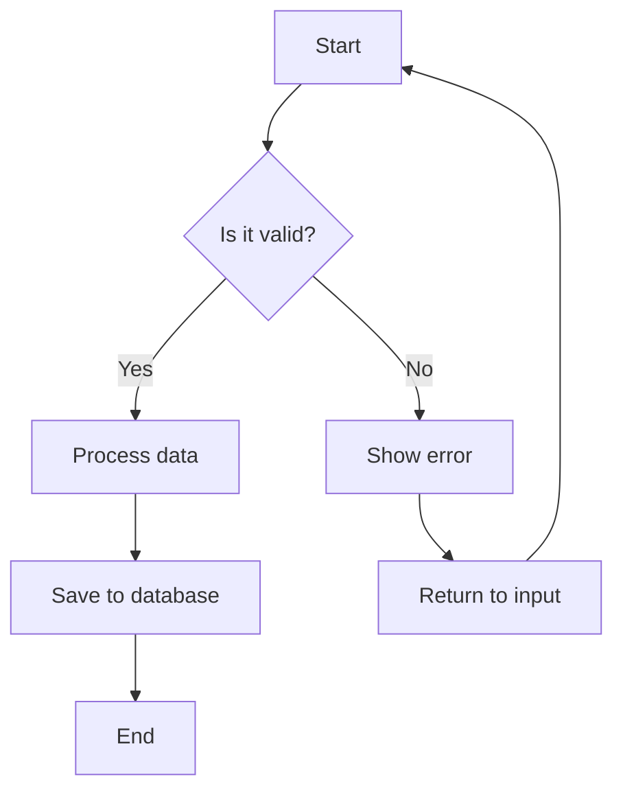

### Flowchart Syntax
```
flowchart TD          %% TD = top-down, LR = left-right, RL, BT
    A[Rectangle]      %% Square brackets = rectangle
    B(Rounded)        %% Parentheses = rounded rectangle
    C{Diamond}        %% Curly braces = diamond/decision
    D[[Subroutine]]   %% Double brackets = subroutine
    E[(Database)]     %% Cylinder shape
    F((Circle))       %% Double parentheses = circle
    G>Asymmetric]     %% Flag shape

    A --> B           %% Arrow
    B --- C           %% Line without arrow
    C -.-> D          %% Dotted arrow
    D ==> E           %% Thick arrow
    E --text--> F     %% Arrow with label
    F -->|label| G    %% Alternative label syntax
```

### Subgraphs
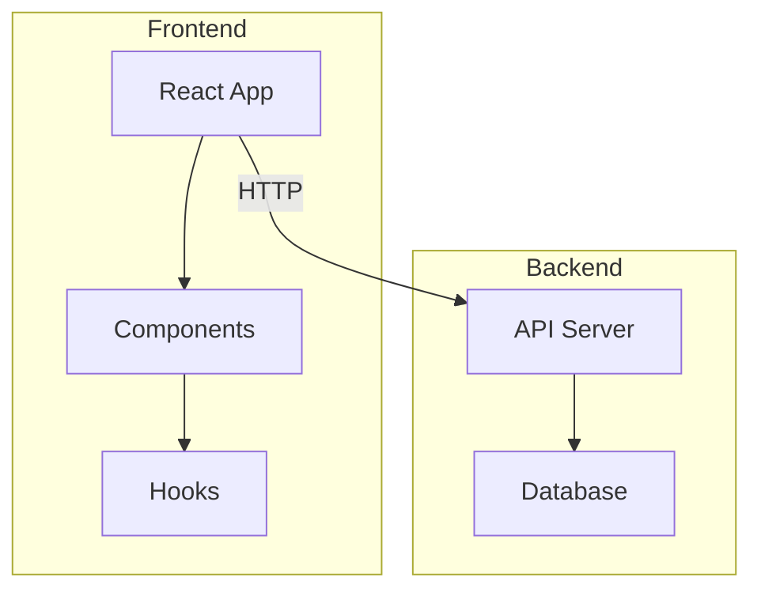

## Sequence Diagram

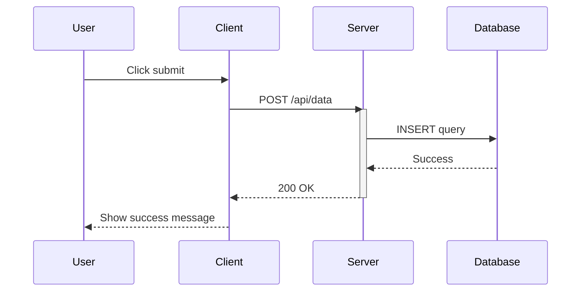

### Sequence Diagram Syntax
```
sequenceDiagram
    participant A as Alice
    participant B as Bob

    A->>B: Solid line with arrow
    A-->>B: Dotted line with arrow
    A-)B: Solid line with open arrow
    A--)B: Dotted line with open arrow
    
    activate B          %% Activation box
    B->>A: Response
    deactivate B
    
    Note over A,B: This is a note
    Note right of A: Note on right
    
    alt Condition true
        A->>B: Do this
    else Condition false
        A->>B: Do that
    end
    
    loop Every minute
        A->>B: Ping
    end
    
    opt Optional action
        A->>B: Maybe do this
    end
```

## Class Diagram

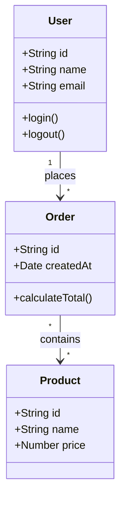

### Class Diagram Syntax
```
classDiagram
    class ClassName {
        +publicField
        -privateField
        #protectedField
        ~packageField
        +publicMethod()
        -privateMethod()
    }
    
    ClassA <|-- ClassB : Inheritance
    ClassC *-- ClassD : Composition
    ClassE o-- ClassF : Aggregation
    ClassG --> ClassH : Association
    ClassI ..> ClassJ : Dependency
    ClassK ..|> ClassL : Realization
```

## Entity Relationship Diagram

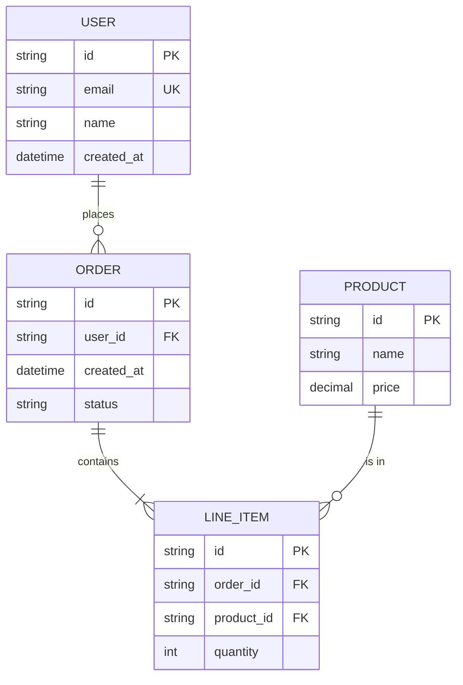

### ER Diagram Cardinality
```
||--||   One to one
||--o{   One to zero or more
||--|{   One to one or more
}o--o{   Zero or more to zero or more
```

## Gantt Chart

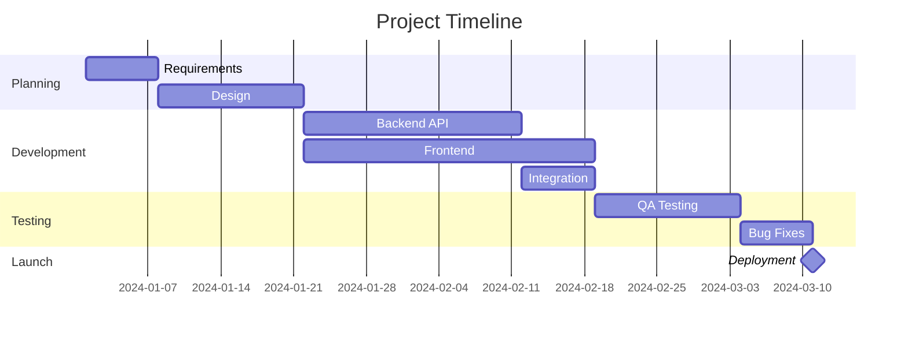

## State Diagram

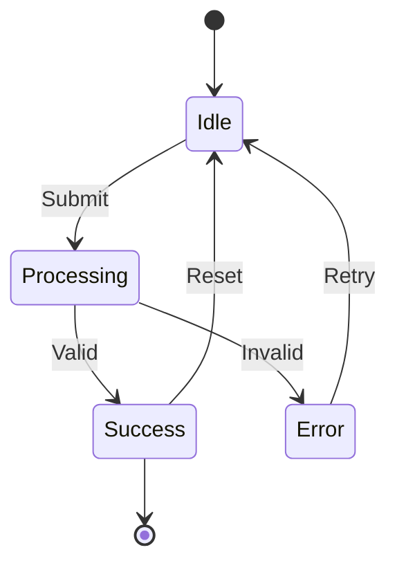

## Pie Chart

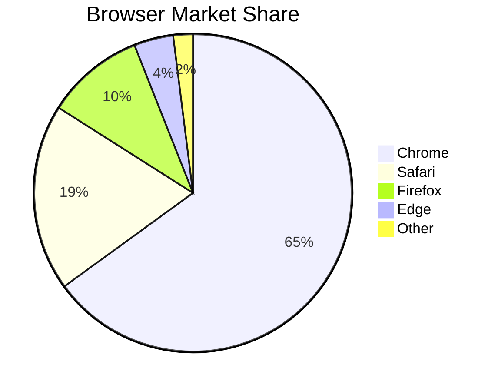

## Git Graph

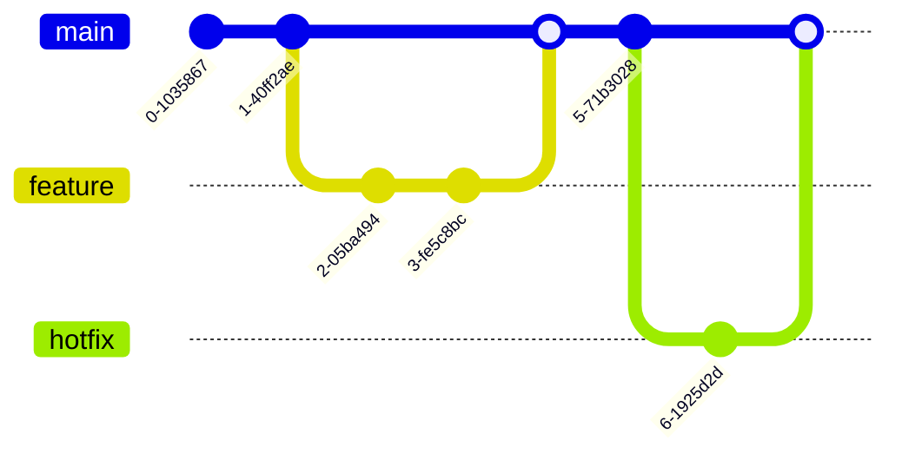

## User Journey

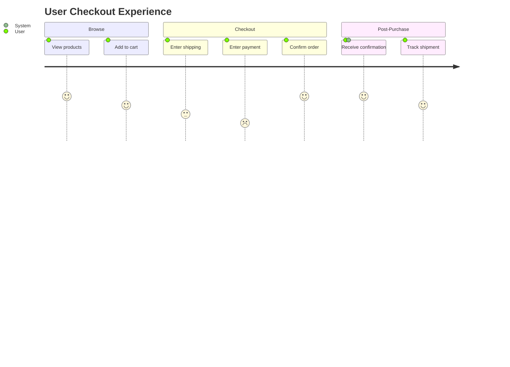

## Mindmap

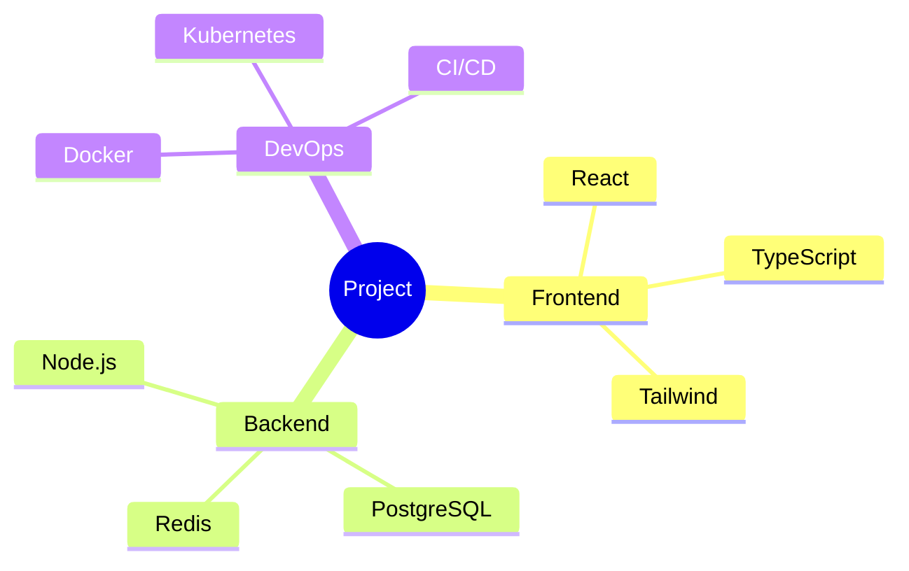

## Styling

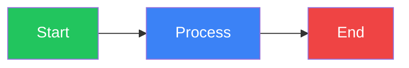

## React Component

```tsx
import mermaid from 'mermaid';
import { useEffect, useRef } from 'react';

mermaid.initialize({
  startOnLoad: true,
  theme: 'neutral', // default, dark, forest, neutral
  securityLevel: 'loose',
});

interface MermaidProps {
  chart: string;
  id?: string;
}

export function Mermaid({ chart, id = 'mermaid-diagram' }: MermaidProps) {
  const ref = useRef<HTMLDivElement>(null);

  useEffect(() => {
    if (ref.current) {
      mermaid.render(id, chart).then(({ svg }) => {
        if (ref.current) {
          ref.current.innerHTML = svg;
        }
      });
    }
  }, [chart, id]);

  return <div ref={ref} className="mermaid-container" />;
}

// Usage
<Mermaid
  chart={`
    flowchart LR
      A --> B --> C
  `}
/>
```

## Tips

1. **Direction**: Use `TD` (top-down), `LR` (left-right), `BT` (bottom-top), `RL` (right-left)
2. **Comments**: Use `%%` for comments
3. **Quotes**: Use quotes for labels with special characters: `A["Label with (parentheses)"]`
4. **Line breaks**: Use `<br/>` for multi-line labels

## Resources

- **Mermaid Docs**: https://mermaid.js.org/
- **Live Editor**: https://mermaid.live
- **GitHub Support**: Mermaid works natively in GitHub markdown
