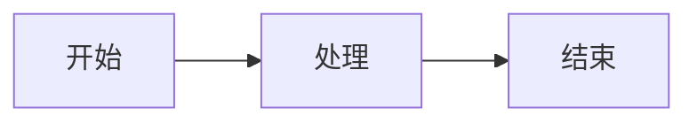

# Talk to Slidev 工作流

你的 AI 主题演讲团队，为创建精美的 Slidev 演示文稿提供 19 个预配置技能。

## 目标用户

- **主题演讲者** - 自动化创建带精美动画的幻灯片
- **技术大会讲者** - Mermaid 图表、代码块、技术幻灯片
- **创业者** - 专业视觉设计的路演 Pitch Deck
- **教育工作者和培训师** - 课程材料和讲座幻灯片

## 安装

```bash
npx add-skill nicepkg/ai-workflow/workflows/talk-to-slidev-workflow
```

## 包含的技能（19 个）

### 0. 创意到叙事结构

| 技能 | 功能描述 |
|:------|:-------------|
| `storyline-builder` | 麦肯锡 MECE 叙事框架、幻灯片标题、关键转场 |
| `presentation-builder` | 通用演示结构，带视觉提示 |

### 1. 脚本与演讲备注

| 技能 | 功能描述 |
|:------|:-------------|
| `presentation-generator` | HTML 演示文稿生成、备份导出格式 |

### 2. 视觉主题与设计

| 技能 | 功能描述 |
|:------|:-------------|
| `theme-factory` | 一键主题选择：颜色、字体、统一风格 |
| `presentation-design-enhancer` | 将要点转化为视觉叙事 |
| `color-palette-extractor` | 从图片提取并应用配色方案 |
| `font-pairing-suggester` | 专业的演示文稿字体搭配 |
| `canvas-design` | 为幻灯片创建视觉素材 |

### 3. 媒体与素材

| 技能 | 功能描述 |
|:------|:-------------|
| `pexels-media` | 查找带元数据的免版权图片和视频 |
| `nano-banana-pro` | AI 生成插图、信息图、封面图 |
| `youtube-transcript` | 从 YouTube 提取内容用于研究/引用 |
| `transcribe-and-analyze` | 音频/视频转录和分析 |

### 4. 图表与信息图

| 技能 | 功能描述 |
|:------|:-------------|
| `mermaid-diagrams` | 流程图、架构图、时间线，用于 Slidev |
| `mermaid-tools` | 高级 Mermaid 图表编辑和验证 |
| `infographic-creation` | 将文本转化为信息图风格的视觉效果 |

### 5. 导出与复用

| 技能 | 功能描述 |
|:------|:-------------|
| `pptx` | 需要时导出为 PowerPoint 格式 |
| `social-repurposer` | 将幻灯片复用到社交媒体（LinkedIn、Twitter） |

### 6. Slidev 框架参考

| 技能 | 功能描述 |
|:------|:-------------|
| `slidev` | Slidev 框架完整指南：语法、布局、组件、动画、主题、导出 |
| `slidev-presentations` | 计划优先的演示工作流，支持 `/slidev:plan`、`/slidev:from-plan`、`/slidev:new` 命令 |

## 完整流水线（6 阶段）

```
阶段 0：创意输入
└── storyline-builder → MECE 叙事结构，带幻灯片标题

阶段 1：脚本生成
└── presentation-builder → 详细演示大纲

阶段 2：Slidev 生成
├── slidev-presentations → 计划优先工作流 (/slidev:plan → /slidev:from-plan)
├── slidev → 框架参考：语法、布局、动画
├── theme-factory → 应用统一视觉主题
└── presentation-design-enhancer → 可视化文字密集的幻灯片

阶段 3：媒体与素材
├── pexels-media → 查找素材图片
├── nano-banana-pro → 生成自定义视觉效果
└── color-palette-extractor → 提取主题颜色

阶段 4：图表与图表
├── mermaid-diagrams → 技术图表
├── mermaid-tools → 验证和增强图表
└── infographic-creation → 总结/框架页面

阶段 5：导出与分享
├── pptx → PowerPoint 备份导出
└── social-repurposer → 社交媒体片段
```

## 示例工作流

### 技术大会演讲

```
1. "我想演讲 '我们如何扩展到 100 万用户' - 创建叙事结构"
2. "生成完整的演讲稿，带演讲备注"
3. "创建带技术架构图的 Slidev markdown"
4. "为系统架构添加 mermaid 图表"
5. "为每个部分找相关的素材图片"
6. "应用适合技术大会的现代深色主题"
```

### 创业 Pitch Deck

```
1. "为 SaaS 创业公司创建 10 页 pitch deck 结构"
2. "生成带问题-解决方案-市场流程的吸引人叙事"
3. "为市场规模和增长预测设计信息图"
4. "添加专业视觉效果和统一品牌"
5. "导出 PPTX 用于投资人会议"
```

### 教育课程

```
1. "为 '机器学习入门' 构建讲座系列结构"
2. "创建带分步解释的幻灯片"
3. "为算法流程图添加 mermaid 图表"
4. "包含带语法高亮的代码块"
5. "为每个模块生成总结信息图"
```

### YouTube 脚本转幻灯片

```
1. "从这个 YouTube 视频提取字幕"
2. "将内容转换为演示大纲"
3. "生成带关键点的 Slidev 幻灯片"
4. "添加相关视觉效果和图表"
```

## 技能组合

| 目标 | 技能链 |
|:-----|:------------|
| **完整主题演讲** | storyline-builder → slidev-presentations → theme-factory → presentation-design-enhancer → mermaid-diagrams → pexels-media |
| **技术演讲** | storyline-builder → slidev-presentations → mermaid-diagrams → mermaid-tools → canvas-design |
| **Pitch Deck** | presentation-builder → slidev-presentations → infographic-creation → nano-banana-pro → pptx |
| **视频转幻灯片** | youtube-transcript → storyline-builder → slidev-presentations → presentation-design-enhancer |
| **视觉设计** | theme-factory → color-palette-extractor → font-pairing-suggester → canvas-design |
| **社交片段** | presentation-generator → social-repurposer |

## Slidev 快速参考

### 基本幻灯片结构

```markdown
---
theme: seriph
background: https://example.com/image.jpg
class: text-center
---

# 幻灯片标题

内容放这里

---

# 下一张幻灯片
```

### Mermaid 图表

````markdown

````

### 带高亮的代码块

````markdown
```python {1-3|5-7}
def hello():
    print("Hello")
    return True

def world():
    print("World")
    return True
```
````

## 高级选项

```bash
# 全局安装
npx add-skill nicepkg/ai-workflow/workflows/talk-to-slidev-workflow --global

# 安装特定技能
npx add-skill nicepkg/ai-workflow/workflows/talk-to-slidev-workflow --skill slidev-presentations

# 列出所有技能
npx add-skill nicepkg/ai-workflow/workflows/talk-to-slidev-workflow --list
```

## 链接

- [在 GitHub 上查看](https://github.com/nicepkg/ai-workflow/tree/main/workflows/talk-to-slidev-workflow)
- [贡献指南](/zh/docs/contributing)
