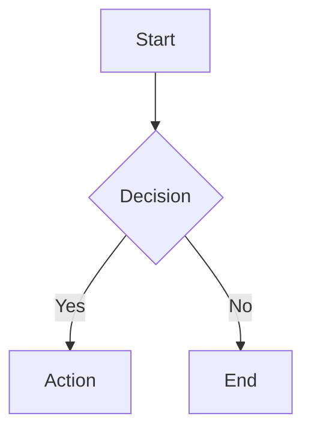

# Slidev Presentations Skill

Generate professional, browser-based presentations using [Slidev](https://sli.dev/) - the presentation framework for developers.

## When to Use This Skill

Activate when the user requests:

- Creating presentation slides
- Technical talks or conference presentations
- Developer-focused slide decks
- Markdown-based presentations with code examples
- Interactive presentations with animations

### Example Trigger Phrases

These prompts should activate this skill:

- "Create a presentation about Kubernetes architecture"
- "Make slides for my talk on TypeScript best practices"
- "Generate a Slidev deck explaining our API design"
- "Build a technical presentation for the team meeting"
- "I need slides for a conference talk on microservices"
- "Create a workshop presentation with code examples"
- "Make a deck covering React hooks for beginners"
- "Generate presentation slides about CI/CD pipelines"

### NOT This Skill

Do NOT activate for:

- PowerPoint or Google Slides requests (different format)
- Simple document or README generation
- Non-presentation Markdown files
- Requests for presentation tips without actual slide creation

## Recommended Workflow

Follow the **plan-first approach** for quality presentations:

```text
1. Gather Context  →  2. Create Plan  →  3. Review Plan  →  4. Generate Slides
```

### Why Plan First?

- Plans capture audience, duration, and core message
- Review checkpoint before investing in slide generation
- Plans become presenter notes and Q&A preparation
- Easier to iterate on structure than on finished slides

### Workflow Options

| Scenario                      | Command                                         | Output        |
| ----------------------------- | ----------------------------------------------- | ------------- |
| New presentation on a topic   | `/slidev:plan [topic]` then `/slidev:from-plan` | Plan + Slides |
| Presentation about a codebase | `/slidev:from-codebase [path]`                  | Plan + Slides |
| Quick slides (skip planning)  | `/slidev:new [topic]`                           | Slides only   |
| Generate from existing plan   | `/slidev:from-plan [plan-file]`                 | Slides only   |

### Plan Document Structure

A presentation plan includes:

- **Metadata**: Duration, audience, format, venue
- **Core Message**: The ONE thing to remember
- **Time Allocation**: Section breakdown with minutes
- **Section Details**: Key points, visuals needed, talking points
- **Diagrams to Create**: Architecture, flow, comparisons
- **Code Examples**: Files, lines, what to highlight
- **Demo Plan**: What to show, commands, backup plan
- **Q&A Preparation**: Anticipated questions and answers
- **Presenter Checklist**: Before/during presentation tasks

### Questions to Gather

When creating a plan, gather:

1. **Duration**: Lightning (5-10 min) to deep dive (45-60 min)
2. **Audience**: Peers, leadership, external, onboarding
3. **Format**: Lecture, demo-heavy, workshop, Q&A-heavy
4. **Venue**: Team meeting, conference, client presentation
5. **Focus Areas**: Architecture, features, API, testing, DevOps
6. **Technical Depth**: High-level, moderate, deep dive
7. **Core Message**: What's the ONE thing to remember?
8. **Call to Action**: What should audience DO after?

## Example Outputs

See the `assets/` directory for complete example presentations:

- `example-technical-talk.md` - Conference-style deep dive (Kubernetes)
- `example-tutorial.md` - Workshop format with exercises (TypeScript)
- `example-team-update.md` - Internal team presentation (Q4 update)

## Reference Documentation

See the `references/` directory for detailed documentation:

- [slidev-quick-reference.md](references/slidev-quick-reference.md) - Complete syntax cheatsheet
- [layouts-guide.md](references/layouts-guide.md) - All layouts with usage guidance
- [themes.md](references/themes.md) - Theme options and customization
- [advanced-features.md](references/advanced-features.md) - Monaco editor, animations, addons, icons
- [multi-file-organization.md](references/multi-file-organization.md) - Splitting presentations across files

## Quick Setup

If the user doesn't have Slidev installed, provide these commands:

```bash
# Create new presentation (recommended)
npm init slidev@latest

# Or with pnpm
pnpm create slidev

# Or add to existing project
npm install @slidev/cli @slidev/theme-default
```

## Linting Configuration (Required)

Slidev's multi-frontmatter syntax conflicts with standard markdown linters. **Always ensure a `.markdownlint.json` exists** in the presentation directory before generating slides.

### Why This Matters

Slidev uses `---` separators with per-slide frontmatter:

```markdown
---
layout: section
---
```

Standard markdownlint interprets `layout: section` + `---` as a setext-style heading and "fixes" it to `## layout: section`, corrupting the presentation.

### Required Configuration

Create `.markdownlint.json` in the presentation directory:

```json
{
  "MD003": false,
  "MD024": false,
  "MD025": false,
  "MD026": false,
  "MD033": false,
  "MD041": false
}
```

| Rule  | Why Disabled                                             |
| ----- | -------------------------------------------------------- |
| MD003 | Prevents setext→ATX conversion that corrupts frontmatter |
| MD024 | Slides often have repeated headings across slides        |
| MD025 | Each slide can have its own H1                           |
| MD026 | Slide titles may end with punctuation                    |
| MD033 | Slidev uses inline HTML for layouts and animations       |
| MD041 | First line is YAML frontmatter, not a heading            |

### Automatic Setup

All `/slidev:*` commands should check for and create this config file before writing `slides.md`. If modifying an existing presentation, verify the config exists first.

Run the presentation:

```bash
# Development mode with hot reload
npx slidev

# Build for production
npx slidev build

# Export to PDF (requires playwright-chromium)
npx slidev export

# Export to PPTX
npx slidev export --format pptx
```

## Output Format

Generate a complete `slides.md` file that can be run directly with Slidev.

## Core Syntax (Quick Reference)

For full syntax details, see `references/slidev-quick-reference.md`.

### Basic Structure

```markdown
---
theme: default
title: My Presentation
transition: slide-left
mdc: true
---

# First Slide

Content here

---

# Second Slide

More content
```

### Key Layouts

| Layout            | Use Case                  |
| ----------------- | ------------------------- |
| `cover`           | Title slide               |
| `center`          | Centered content          |
| `section`         | Section divider           |
| `two-cols`        | Side-by-side content      |
| `two-cols-header` | Header + two columns      |
| `image-right`     | Image right, content left |
| `fact`            | Highlight a statistic     |

### Two-Column Layout

```markdown
---
layout: two-cols-header
---

# Header

::left::

Left content

::right::

Right content
```

### Code with Line Highlighting

````markdown
```typescript {2,3}
function add(a: number, b: number) {
  const sum = a + b  // highlighted
  return sum         // highlighted
}
```
````

### Click-to-Reveal Code

````markdown
```typescript {1|2|3|all}
const a = 1  // click 1
const b = 2  // click 2
const c = 3  // click 3
```
````

### Animations

```html
<!-- Reveal items one-by-one -->
<v-clicks>

- First item (click 1)
- Second item (click 2)

</v-clicks>

<!-- Single element reveal -->
<div v-click>Appears on click</div>
```

### Presenter Notes

```markdown
# Slide Title

Content

<!--
Speaker notes here (presenter mode only)
-->
```

### Diagrams (Mermaid)

````markdown

````

## Advanced Features

For advanced functionality, see [references/advanced-features.md](references/advanced-features.md):

- **Shiki Magic Move** - Animated code transitions
- **Monaco Editor** - Interactive, editable code blocks (`{monaco}`, `{monaco-run}`)
- **v-motion** - Movement animations
- **v-mark** - Hand-drawn style annotations
- **Addons** - Python execution, QR codes, diagrams
- **Icons** - 100k+ icons via UnoCSS
- **Live Drawing** - Annotation during presentations

## Multi-File Organization

For large presentations (30+ slides), split across multiple files. See [references/multi-file-organization.md](references/multi-file-organization.md).

Quick example:

```markdown
---
src: ./slides/01-intro.md
---

---
src: ./slides/02-content.md
---
```

Benefits: No linting conflicts, easier reorganization, better version control.
