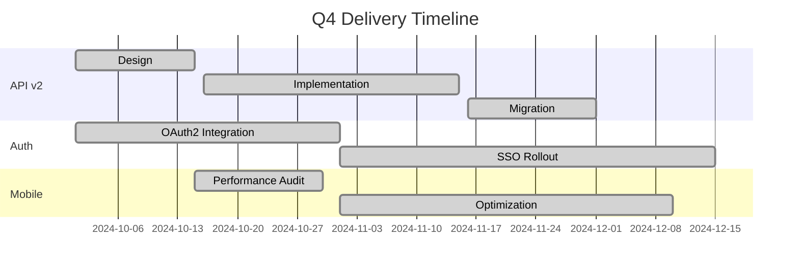

# Q4 Engineering Update

Platform Team - December 2024

<!--
Keep it brief - 15 minutes max
Focus on wins and blockers
End with clear Q1 priorities
-->

---

## layout: two-cols-header

## Q4 Highlights

::left::

### Shipped

<v-clicks>

- API v2 migration complete
- New authentication system live
- Mobile app performance +40%
- Zero-downtime deploys enabled

</v-clicks>

::right::

### Metrics

<v-clicks>

- **99.97%** uptime (target: 99.9%)
- **145ms** avg API latency (-35%)
- **23** PRs merged per week
- **0** P0 incidents

</v-clicks>

---

## Key Achievements

---

## layout: fact

## 40%

Mobile app performance improvement

App store rating: 4.2 → 4.6 ⭐

---

## Technical Debt Addressed

| Area          | Before      | After      | Impact            |
| ------------- | ----------- | ---------- | ----------------- |
| Test Coverage | 62%         | 84%        | Fewer regressions |
| Build Time    | 8m 30s      | 3m 45s     | Faster iteration  |
| Dependencies  | 47 outdated | 3 outdated | Security posture  |
| Lint Warnings | 1,247       | 89         | Code quality      |

<v-click>

✅ All critical security vulnerabilities resolved

</v-click>

---

## Challenges & Learnings

<v-clicks>

**Database migration complexity**

- Underestimated data transformation time
- Solution: Added staging validation step

**Third-party API instability**

- Payment provider outages affected checkout
- Solution: Implemented circuit breaker pattern

**Team capacity**

- Lost 2 engineers mid-quarter
- Solution: Prioritized ruthlessly, delayed non-critical work

</v-clicks>

---

## layout: section

## Q1 2025 Priorities

---

## Q1 Roadmap

<v-clicks>

#### 1. Platform Reliability

- Multi-region deployment
- Automated failover
- Target: 99.99% uptime

#### 2. Developer Experience

- Internal CLI tool
- Improved local dev environment
- Documentation overhaul

#### 3. Feature Velocity

- Feature flag system
- A/B testing infrastructure
- Faster experiment cycles

</v-clicks>

---

## Resource Asks

<v-clicks>

**Headcount**

- 1 Senior SRE (critical for multi-region)
- 1 Backend Engineer (feature velocity)

**Infrastructure**

- $15k/month additional cloud spend for redundancy
- Approval for Datadog enterprise tier

**Cross-team**

- Design review sessions (2hr/week)
- Product alignment on feature flags

</v-clicks>

---

layout: center
class: text-center

---

## Questions?

Detailed metrics: `wiki.internal/eng-q4-report`

