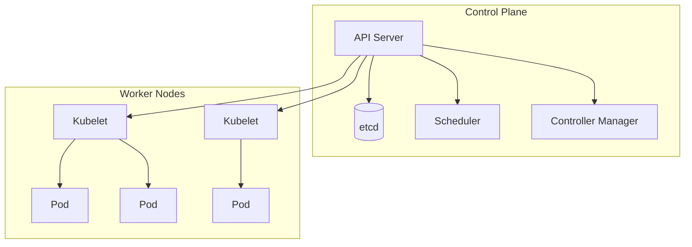

# Introduction to Kubernetes

Container Orchestration for Modern Applications

<div class="pt-12">
  <span class="px-2 py-1 rounded cursor-pointer" hover="bg-white bg-opacity-10">
    Press Space for next slide <carbon:arrow-right class="inline"/>
  </span>
</div>

<!--
Welcome everyone! Today we'll explore Kubernetes architecture.
Key points to cover:
- Why container orchestration matters
- Core components
- Practical examples
-->

---

## layout: two-cols-header

## What is Kubernetes?

::left::

**Container Orchestration Platform**

- Automates deployment, scaling, and management
- Originally designed by Google
- Now maintained by CNCF
- De facto standard for container orchestration

::right::

**Key Benefits**

<v-clicks>

- Self-healing infrastructure
- Horizontal scaling
- Service discovery & load balancing
- Automated rollouts & rollbacks

</v-clicks>

<!--
Emphasize that K8s solves real operational problems.
Mention that Google runs billions of containers weekly.
-->

---

layout: center
class: text-center

---

## Core Architecture

<div class="text-xl text-gray-500 mb-8">
Understanding the control plane and worker nodes
</div>



---

## Pod: The Smallest Unit

A Pod is one or more containers that share storage and network.

```yaml {all|2-3|5-12|14-17|all}
apiVersion: v1
kind: Pod
metadata:
  name: web-app
spec:
  containers:
    - name: nginx
      image: nginx:1.25
      ports:
        - containerPort: 80
      resources:
        limits:
          memory: "128Mi"
          cpu: "500m"
```

<v-click>

<div class="mt-4 p-4 bg-blue-500 bg-opacity-10 rounded">
💡 <strong>Best Practice:</strong> Always set resource limits to prevent noisy neighbors
</div>

</v-click>

<!--
Walk through each section:
1. API version and kind
2. Metadata for identification
3. Container spec with image
4. Resource limits - critical for production
-->

---

## layout: two-cols

## Deployments

Declarative updates for Pods and ReplicaSets.

```yaml
apiVersion: apps/v1
kind: Deployment
metadata:
  name: web-app
spec:
  replicas: 3
  selector:
    matchLabels:
      app: web
  template:
    metadata:
      labels:
        app: web
    spec:
      containers:
        - name: nginx
          image: nginx:1.25
```

::right::

<div class="pl-4">

### Key Features

<v-clicks>

- **Replica Management**
  - Ensures desired state
  - Auto-healing on failure

- **Rolling Updates**
  - Zero-downtime deployments
  - Configurable surge/unavailable

- **Rollback**
  - Instant version revert
  - History preserved

</v-clicks>

</div>

---

## layout: section

## Demo Time

Let's deploy an application to Kubernetes

---

## Deploying Our App

```bash {1|2|3|4|all}
# Create the deployment
kubectl apply -f deployment.yaml

# Watch pods come up
kubectl get pods -w

# Expose via service
kubectl expose deployment web-app --port=80 --type=LoadBalancer

# Check service endpoint
kubectl get svc web-app
```

<v-click>

**Output:**

```text
NAME      TYPE           CLUSTER-IP     EXTERNAL-IP    PORT(S)
web-app   LoadBalancer   10.96.45.123   203.0.113.50   80:31234/TCP
```

</v-click>

---

## layout: fact

## 5.6 Million+

Kubernetes developers worldwide

<div class="text-2xl text-gray-400 mt-4">
92% of organizations use containers in production
</div>

---

layout: center
class: text-center

---

## Key Takeaways

<v-clicks>

**Start with Pods** → Understand the building block

**Use Deployments** → Never manage Pods directly

**Define Resources** → Limits prevent cascading failures

**Embrace Declarative** → GitOps is the way

</v-clicks>

---

## layout: end

## Thank You

Questions?

<div class="mt-8">

📧 <speaker@example.com>

🐦 @speaker

📖 github.com/speaker/k8s-demo

</div>
