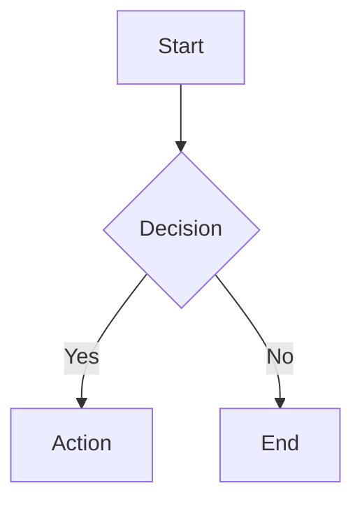
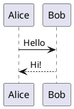

# Slidev Quick Reference

## Project Setup

```bash
# Create new project
npm init slidev@latest

# Or in existing project
npm install @slidev/cli @slidev/theme-default

# Start dev server
npx slidev

# Build for production
npx slidev build

# Export to PDF
npx slidev export
```

## File Structure

```text
project/
├── slides.md          # Main presentation
├── package.json
├── components/        # Custom Vue components
├── pages/             # Additional slide files
├── public/            # Static assets
└── styles/            # Custom CSS
```

## Frontmatter (Global Config)

Place at the very start of `slides.md`:

```yaml
---
theme: default
title: Presentation Title
info: |
  ## Description
  Multi-line info shown in presenter mode
author: Your Name
keywords: keyword1,keyword2
highlighter: shiki
lineNumbers: true
transition: slide-left
mdc: true
download: true
exportFilename: my-presentation
drawings:
  persist: false
class: text-center
---
```

## Slide Separator

Slides are separated by `---` on its own line:

```markdown
# Slide 1

Content

---

# Slide 2

More content
```

## Slide-Level Frontmatter

```yaml
---
layout: center
background: /image.jpg
class: my-custom-class
transition: fade
clicks: 3
---
```

## Layouts Reference

| Layout            | Use Case                  |
| ----------------- | ------------------------- |
| `default`         | Standard content slide    |
| `center`          | Centered content          |
| `cover`           | Title/opening slide       |
| `intro`           | Introduction slide        |
| `section`         | Section divider           |
| `statement`       | Bold statement            |
| `fact`            | Highlight a statistic     |
| `quote`           | Quotation                 |
| `image`           | Full-bleed image          |
| `image-left`      | Image left, content right |
| `image-right`     | Image right, content left |
| `two-cols`        | Two columns               |
| `two-cols-header` | Header + two columns      |
| `iframe`          | Embed webpage             |
| `end`             | Closing slide             |
| `none`            | No default styling        |

## Two-Column Layouts

```markdown
---
layout: two-cols
---

# Left Side

Content here

::right::

# Right Side

Content here
```

```markdown
---
layout: two-cols-header
---

# Spanning Header

::left::

Left content

::right::

Right content
```

## Code Blocks

### Basic

````markdown
```typescript
const x = 1
```
````

### Line Highlighting

````markdown
```typescript {2,3}
const a = 1
const b = 2  // highlighted
const c = 3  // highlighted
```
````

### Click-to-Reveal Lines

````markdown
```typescript {1|2|3|all}
const a = 1  // click 1
const b = 2  // click 2
const c = 3  // click 3
```
````

### Line Numbers

````markdown
```typescript {lines:true}
// Shows line numbers
```

```typescript {2,3}{lines:true,startLine:5}
// Line numbers start at 5
```
````

### Scrollable Code

````markdown
```typescript {*}{maxHeight:'200px'}
// Long code block becomes scrollable
```
````

### Monaco Editor (Interactive)

````markdown
```typescript {monaco}
// Live editable code
```
````

## Animations

### v-click (Reveal on Click)

```html
<v-click>
This appears after one click
</v-click>

<div v-click>Also works on elements</div>

<div v-click="3">Appears on click 3</div>
```

### v-clicks (Auto-wrap List Items)

```html
<v-clicks>

- First (click 1)
- Second (click 2)
- Third (click 3)

</v-clicks>
```

### v-after (Same Time as Previous)

```html
<div v-click>Appears first</div>
<div v-after>Appears simultaneously</div>
```

### Hide on Click

```html
<div v-click.hide="3">Hidden after 3 clicks</div>
```

### Click Ranges (Visibility Windows)

Control when elements appear AND disappear:

```html
<!-- Visible at clicks 2-4, hidden before and after -->
<div v-click="[2, 5]">Visible at clicks 2, 3, 4</div>

<!-- Hide during a specific range -->
<div v-click.hide="[2, 4]">Hidden at clicks 2, 3</div>
```

### Relative Click Positioning

Position clicks relative to the previous element:

```html
<div v-click>First (click 1)</div>
<div v-click="'+2'">Two clicks later (click 3)</div>
<div v-click="'-1'">One click before previous (click 2)</div>
```

Use quotes for relative values: `'+1'`, `'-1'`, `'+2'`

### v-clicks Options

Control batch reveal behavior:

```html
<!-- Apply to nested children (depth levels) -->
<v-clicks depth="2">
  <li>Item with <strong>nested bold</strong></li>
</v-clicks>

<!-- Reveal multiple items per click -->
<v-clicks every="2">
  <li>A</li><li>B</li>  <!-- Both on click 1 -->
  <li>C</li><li>D</li>  <!-- Both on click 2 -->
</v-clicks>
```

### v-motion (Movement Animations)

Animate element position, scale, and opacity using @vueuse/motion:

```html
<!-- Basic enter/leave animation -->
<div
  v-motion
  :initial="{ x: -80, opacity: 0 }"
  :enter="{ x: 0, opacity: 1 }"
  :leave="{ x: 80, opacity: 0 }"
>
  Slides in from left, exits to right
</div>
```

**Motion States:**

- `initial` - Before entering the slide
- `enter` - When slide is active and element is visible
- `leave` - When leaving the slide

**Click-Triggered Motion:**

```html
<div
  v-motion
  :initial="{ y: 100, opacity: 0 }"
  :enter="{ y: 50, opacity: 0.5 }"
  :click-1="{ y: 0, opacity: 1 }"
  :click-2="{ scale: 1.2 }"
  :click-2-4="{ x: 40 }"
>
  Multi-step motion animation
</div>
```

- `click-x` - Triggers at click number x
- `click-x-y` - Active during clicks x through y-1

**Combining with v-click:**

```html
<div v-click="[2, 4]" v-motion
  :initial="{ scale: 0 }"
  :enter="{ scale: 1 }"
  :leave="{ scale: 0 }"
>
  Appears at click 2, animates out at click 4
</div>
```

**Supported Properties:** `x`, `y`, `scale`, `rotate`, `opacity`, `skewX`, `skewY`

## Presenter Notes

```markdown
# Slide Title

Visible content

<!--
Speaker notes here (only in presenter mode)
- Bullet points work
- **Markdown** supported
-->
```

## Transitions

Global (in frontmatter):

```yaml
transition: slide-left
```

Per-slide:

```yaml
---
transition: fade
---
```

**Built-in Options:** `slide-left`, `slide-right`, `slide-up`, `slide-down`, `fade`, `fade-out`, `view-transition`, `none`

### Directional Transitions

Specify different transitions for forward vs backward navigation:

```yaml
---
transition: slide-left | slide-right
---
```

Format: `forward-transition | backward-transition`

### Custom Transition CSS

Create custom transitions in your `styles/` directory:

```css
/* styles/transitions.css */

/* Define a custom "zoom" transition */
.zoom-enter-active,
.zoom-leave-active {
  transition: all 0.5s ease;
}

.zoom-enter-from {
  opacity: 0;
  transform: scale(0.5);
}

.zoom-leave-to {
  opacity: 0;
  transform: scale(1.5);
}
```

Use in frontmatter:

```yaml
---
transition: zoom
---
```

### Customizing Click Animation Transitions

Override default v-click behavior globally:

```css
/* styles/main.css */
.slidev-vclick-target {
  transition: all 500ms ease;
}

.slidev-vclick-hidden {
  opacity: 0;
  transform: scale(0.8) translateY(10px);
  /* Or use: transform: translateX(-20px); */
}
```

Classes applied automatically:

- `.slidev-vclick-target` - All animated elements
- `.slidev-vclick-hidden` - Hidden state (before reveal or after hide)
- `.slidev-vclick-current` - Currently animating element
- `.slidev-vclick-prior` - Previously revealed elements

## Diagrams

### Mermaid

````markdown

````

### PlantUML

````markdown

````

## Math (LaTeX)

Inline: `$E = mc^2$`

Block:

```markdown
$$
\int_0^\infty e^{-x^2} dx = \frac{\sqrt{\pi}}{2}
$$
```

## Images

```markdown
<!-- In frontmatter for background -->
---
background: /path/to/image.jpg
---

<!-- Inline -->


<!-- With MDC sizing (requires mdc: true) -->
{width=400px}
```

## MDC Syntax

Enable in frontmatter: `mdc: true`

```markdown
<!-- Styled text -->
This is [red text]{style="color:red"}

<!-- Image with attributes -->
{width=500px}

<!-- Block component -->
::block-component{prop="value"}
Content
::
```

## Global Styles

Add at end of any slide:

```html
<style>
h1 {
  color: #2B90B6;
}
.slidev-layout {
  background: #f5f5f5;
}
</style>
```

## Importing External Slides

```markdown
---
src: ./pages/intro.md
---

---

# Regular Slide

---
src: ./pages/outro.md
---
```

## Shiki Magic Move (Animated Code Transitions)

Animate between code states with smooth transitions:

`````markdown
````md magic-move
```js
// Step 1: Initial state
const count = 1
```

```js
// Step 2: Added line
const count = 1
const doubled = count * 2
```

```js
// Step 3: Refactored
function double(n) {
  return n * 2
}
const result = double(1)
```
````
`````

Each code block becomes a step. Slidev animates the differences between steps on click.

## Vue Components

Create custom components in `components/` directory:

```text
project/
├── slides.md
└── components/
    └── Counter.vue
```

```vue
<!-- components/Counter.vue -->
<script setup>
import { ref } from 'vue'
const count = ref(0)
</script>

<template>
  <button @click="count++">Count: {{ count }}</button>
</template>
```

Use directly in slides:

```markdown
# Interactive Demo

<Counter />
```

## UnoCSS (Built-in Utility Classes)

UnoCSS is pre-configured. Use Tailwind-like utilities directly:

```markdown
# Styled Content

<div class="text-3xl font-bold text-blue-500 p-4 rounded-lg bg-gray-100">
  Styled with utilities
</div>

<div class="flex gap-4 items-center justify-between">
  <span class="text-red-500">Left</span>
  <span class="text-green-500">Right</span>
</div>
```

Common utilities:

- **Text**: `text-sm`, `text-xl`, `text-3xl`, `font-bold`, `text-center`
- **Colors**: `text-blue-500`, `bg-gray-100`, `border-red-300`
- **Spacing**: `p-4`, `m-2`, `px-6`, `py-3`, `gap-4`
- **Flexbox**: `flex`, `items-center`, `justify-between`, `flex-col`
- **Grid**: `grid`, `grid-cols-2`, `grid-cols-3`

## Scoped Styles

Style a specific slide only:

```markdown
# My Slide

Content here

<style scoped>
h1 {
  color: #e11d48;
  font-size: 3rem;
}
</style>
```

## CLI Commands

```bash
# Development
npx slidev                    # Start dev server
npx slidev --port 8080        # Custom port
npx slidev --open             # Auto-open browser

# Build
npx slidev build              # Build SPA
npx slidev build --base /sub/ # Custom base path

# Export
npx slidev export             # Export to PDF
npx slidev export --dark      # Dark mode export
npx slidev export --with-clicks  # Separate page per click
npx slidev export --format png   # Export as images
npx slidev export --format pptx  # Export to PowerPoint
```

## Keyboard Shortcuts (Presentation Mode)

| Key                 | Action                   |
| ------------------- | ------------------------ |
| `Space` / `→` / `↓` | Next animation/slide     |
| `←` / `↑`           | Previous                 |
| `f`                 | Toggle fullscreen        |
| `o`                 | Toggle overview          |
| `d`                 | Toggle drawing mode      |
| `g`                 | Go to slide              |
| `Esc`               | Exit fullscreen/overview |

## v-mark Rough Annotations

Hand-drawn style emphasis using RoughNotation:

```html
<span v-mark.underline>Important</span>
<span v-mark.circle>Key term</span>
<span v-mark.highlight="{ color: 'yellow' }">Highlighted</span>
<span v-mark.box>Boxed</span>
<span v-mark.strike>Crossed out</span>
<span v-mark.bracket>Bracketed</span>
```

Click-triggered:

```html
<span v-mark.underline="3">Appears on click 3</span>
```

Types: `underline`, `circle`, `highlight`, `box`, `bracket`, `strike-through`

## Runnable Monaco Editor

Interactive code with live execution:

````markdown
```typescript {monaco}
// Editable code (no execution)
const x = 1
```

```typescript {monaco-run}
// Editable AND executable - output appears below
console.log([1, 2, 3].map(x => x * 2))
```
````

## Live Drawing

Built-in annotation tools (press `d` during presentation):

```yaml
---
drawings:
  enabled: true
  persist: true
  presenterOnly: false
---
```

## Click-Synced Presenter Notes

Use `[click]` markers to sync notes with animations:

```markdown
<v-clicks>

- Point A
- Point B

</v-clicks>

<!--
[click] Notes for Point A
[click] Notes for Point B
-->
```

## Icons (UnoCSS)

100k+ icons from Iconify:

```html
<div class="i-carbon-logo-github text-4xl" />
<div class="i-mdi-heart text-red-500" />
<div class="i-heroicons-check-circle" />
```

Format: `i-{collection}-{icon-name}`

Browse: <https://icones.js.org/>

## Themes

### Official Themes

| Theme         | Description              | Install                     |
| ------------- | ------------------------ | --------------------------- |
| `default`     | Clean, minimal default   | Built-in                    |
| `seriph`      | Elegant serif typography | `@slidev/theme-seriph`      |
| `apple-basic` | Apple Keynote inspired   | `@slidev/theme-apple-basic` |
| `shibainu`    | Playful, colorful design | `@slidev/theme-shibainu`    |
| `bricks`      | Bold, structured blocks  | `@slidev/theme-bricks`      |

### Using a Theme

```yaml
---
theme: seriph
---
```

Or install from npm:

```bash
npm install @slidev/theme-seriph
```

### Theme Gallery

Browse all themes: <https://sli.dev/resources/theme-gallery>

Search npm: <https://www.npmjs.com/search?q=keywords%3Aslidev-theme>

## Addons

Addons extend Slidev with extra features. Add via frontmatter:

```yaml
---
addons:
  - slidev-addon-python-runner
  - slidev-addon-qrcode
---
```

### Popular Addons

| Addon                        | Description                      | Use Case             |
| ---------------------------- | -------------------------------- | -------------------- |
| `slidev-addon-python-runner` | Run Python in slides via Pyodide | Workshops, tutorials |
| `slidev-addon-rabbit`        | Presentation timer & progress    | Time management      |
| `slidev-addon-excalidraw`    | Embed Excalidraw diagrams        | Visual diagrams      |
| `slidev-addon-qrcode`        | Generate QR codes                | Share links          |
| `slidev-addon-asciinema`     | Embed terminal recordings        | CLI demos            |
| `slidev-addon-naive-ui`      | Naive UI components              | Rich UI elements     |

### Installing Addons

```bash
npm install slidev-addon-qrcode
```

Then add to frontmatter `addons` array.

### Addon Gallery

Browse all addons: <https://sli.dev/resources/addon-gallery>

Search npm: <https://www.npmjs.com/search?q=keywords%3Aslidev-addon>

## Additional Resources

- **Official Docs:** <https://sli.dev/>
- **Theme Gallery:** <https://sli.dev/resources/theme-gallery>
- **Addon Gallery:** <https://sli.dev/resources/addon-gallery>
- **GitHub:** <https://github.com/slidevjs/slidev>
- **Icon Browser:** <https://icones.js.org/>
