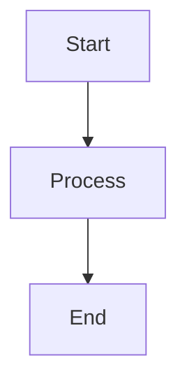
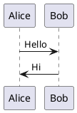

# Slidev

## Overview

Slidev is a presentation platform for developers that enables creating slides using Markdown while leveraging Vue and web technologies for interactive, pixel-perfect designs. This skill provides complete guidance for creating, customizing, and exporting Slidev presentations.

Use this skill when:

- Creating new developer presentations
- Working with Markdown-based slides
- Adding interactive components and animations
- Customizing slide layouts and themes
- Integrating code blocks with syntax highlighting
- Exporting presentations to PDF, PPTX, or PNG
- Setting up Slidev projects

## Quick Start

### Installation and Setup

Create a new Slidev presentation:

```bash
# Using pnpm (recommended)
pnpm create slidev

# Using npm
npm init slidev

# Using yarn
yarn create slidev

# Using bun
bun create slidev
```

Or try online at https://sli.dev/new (StackBlitz)

### Essential Commands

Start development server:

```bash
slidev
# or specify entry file
slidev slides.md
```

Build for production:

```bash
slidev build
```

Export to PDF:

```bash
slidev export
```

Export to other formats:

```bash
slidev export --format pptx
slidev export --format png
slidev export --format md
```

Format slides:

```bash
slidev format
```

---

## Markdown Syntax

### Slide Separators

Separate slides with `---` padded by blank lines:

```md
# Slide 1

Content here

---

# Slide 2

More content
```

### Frontmatter and Headmatter

Configure entire deck with headmatter (first YAML block):

```md
---
theme: default
background: https://cover.sli.dev
title: My Presentation
info: |
  ## Slidev Starter
  Presentation slides for developers
class: text-center
highlighter: shiki
---
```

Configure individual slides with frontmatter:

```md
---
layout: center
background: ./images/bg.jpg
class: text-white
---

# Centered Slide

Content here
```

### Code Blocks

Code with syntax highlighting:

````md
```ts
console.log('Hello, World!')
```
````

With line numbers:

````md
```ts {lines:true}
function greet(name: string) {
  console.log(`Hello, ${name}!`)
}
```
````

With line highlighting:

````md
```ts {2,4-6}
function calculate() {
  const x = 10  // highlighted
  const y = 20
  const sum = x + y  // highlighted
  const product = x * y  // highlighted
  const difference = x - y  // highlighted
  return sum
}
```
````

### Presenter Notes

Add notes at the end of slides using comment blocks:

```md
# Slide Title

Content visible to audience

<!--
Notes for presenter only
Can include **markdown** and HTML
-->
```

---

## Layouts

### Using Layouts

Specify layout in frontmatter:

```md
---
layout: cover
---

# Presentation Title
```

### Built-in Layouts

**Basic Layouts:**
- `default` - Standard layout for any content
- `center` - Centers content on screen
- `cover` - Opening slide for presentations
- `end` - Closing slide
- `none` - Unstyled layout

**Content Layouts:**
- `intro` - Introduction with title and author details
- `section` - Marks new presentation sections
- `quote` - Displays quotations with emphasis
- `fact` - Highlights data or facts prominently
- `statement` - Features affirmations as main content
- `full` - Utilizes entire screen space

**Image Layouts:**
- `image` - Full-screen image display
- `image-left` - Image on left, content on right
- `image-right` - Image on right, content on left

**Iframe Layouts:**
- `iframe` - Full-screen web page embedding
- `iframe-left` - Web page on left side
- `iframe-right` - Web page on right side

**Multi-Column Layouts:**
- `two-cols` - Two-column content separation
- `two-cols-header` - Header spanning both columns with left/right split

### Two-Column Layout Example

```md
---
layout: two-cols
---

# Left Column

Content for left side

::right::

# Right Column

Content for right side
```

### Two-Column with Header

```md
---
layout: two-cols-header
---

# Header Across Both Columns

::left::

Left column content

::right::

Right column content
```

---

## Components

### Built-in Components

**Navigation:**
- `<Link>` - Navigate between slides
- `<Arrow>` - Directional lines with customization
- `<VDragArrow>` - Draggable arrows

**Text:**
- `<AutoFitText>` - Auto-sizing text to fit container
- `<TitleRenderer>` - Display parsed slide titles
- `<Toc>` - Table of contents generation

**Media:**
- `<Youtube>` - Embed YouTube videos
- `<Tweet>` - Embed Twitter posts
- `<SlidevVideo>` - HTML5 video with autoplay

**Utilities:**
- `<SlideCurrentNo>` - Current slide number
- `<SlidesTotal>` - Total slide count
- `<Transform>` - Scaling and transformation
- `<LightOrDark>` - Theme-based content rendering
- `<RenderWhen>` - Conditional rendering by context
- `<VSwitch>` - Cycle between content on click
- `<VDrag>` - Draggable functionality

### Component Usage Examples

```md
<Youtube id="dQw4w9WgXcQ" />

<Tweet id="1234567890" />

<Arrow x1="100" y1="100" x2="200" y2="200" />

<AutoFitText :max="300" :min="20">
  This text will auto-size
</AutoFitText>

<Toc minDepth="1" maxDepth="2" />
```

### Custom Components

Create custom Vue components in `./components/` directory. They are auto-imported without manual registration.

Example structure:

```
./components/
  MyComponent.vue
  Counter.vue
slides.md
```

Use in slides:

```md
<MyComponent />

<Counter :initial="10" />
```

---

## Animations

### Click Animations

**v-click Directive:**

```md
<div v-click>Appears on click</div>
<div v-click>Appears on next click</div>
```

**v-after Directive:**

```md
<div v-click>First</div>
<div v-after>Appears with previous</div>
```

**v-clicks for Lists:**

```md
<v-clicks>

- First item
- Second item
- Third item

</v-clicks>
```

### Animation Positioning

**Absolute positioning:**

```md
<div v-click="1">Shows at step 1</div>
<div v-click="2">Shows at step 2</div>
<div v-click="3">Shows at step 3</div>
```

**Relative positioning:**

```md
<div v-click>First</div>
<div v-click="+2">Skip one step</div>
<div v-click="-1">Same time as previous</div>
```

### Motion Animations

Use `@vueuse/motion` for directional animations:

```md
<div
  v-motion
  :initial="{ x: -80 }"
  :enter="{ x: 0 }">
  Slides in from left
</div>
```

### Slide Transitions

Configure in frontmatter:

```md
---
transition: slide-left
---
```

Available transitions:
- `fade`
- `slide-left`
- `slide-right`
- `slide-up`
- `slide-down`
- `view-transition`

---

## Styling

### UnoCSS Integration

Slidev uses UnoCSS with Tailwind-compatible utilities:

```md
<div class="grid grid-cols-2 gap-4">
  <div class="bg-blue-500 p-4">Column 1</div>
  <div class="bg-red-500 p-4">Column 2</div>
</div>
```

### Custom Styles

Create `./styles/index.css`:

```css
.my-custom-class {
  @apply text-2xl font-bold text-blue-500;
}
```

### Slide-Scoped Styles

Add styles to specific slides:

```md
# Slide Title

Content here

<style>
h1 {
  color: #3b82f6;
}
</style>
```

### Dark Mode Support

UnoCSS dark mode utilities:

```md
<div class="bg-white dark:bg-black text-black dark:text-white">
  Adapts to theme
</div>
```

---

## Exporting

### Browser Export (Recommended)

1. Start dev server: `slidev`
2. Click "Export" button in navigation bar
3. Or visit `http://localhost:3030/export`
4. Choose format and download

### CLI Export

Install Playwright first:

```bash
pnpm add -D playwright-chromium
```

Export to PDF:

```bash
slidev export
# or specify output
slidev export --output my-presentation.pdf
```

Export to PPTX:

```bash
slidev export --format pptx
```

Export to PNG:

```bash
slidev export --format png
```

Export with animations:

```bash
slidev export --with-clicks
```

Export specific slides:

```bash
slidev export --range 1,6-8,10
```

Export in dark mode:

```bash
slidev export --dark
```

### Export Options

- `--output` - Custom filename
- `--format` - Export format (pdf, pptx, png, md)
- `--with-clicks` - Include animation steps
- `--range` - Specific slides (e.g., 1,6-8,10)
- `--dark` - Use dark theme
- `--timeout` - Increase timeout for large presentations
- `--wait` - Add delay before export
- `--with-toc` - Generate PDF outline

---

## Configuration

### Directory Structure

```
./
├─ components/       # Custom Vue components
├─ layouts/          # Custom layouts
├─ public/           # Static assets
├─ setup/            # Custom setup code
├─ snippets/         # Code snippets
├─ styles/           # Custom styles
├─ slides.md         # Main presentation file
├─ vite.config.ts    # Vite configuration
└─ uno.config.ts     # UnoCSS configuration
```

### UnoCSS Configuration

Create `uno.config.ts`:

```ts
import { defineConfig } from 'unocss'

export default defineConfig({
  shortcuts: {
    'bg-main': 'bg-white text-[#181818] dark:(bg-[#121212] text-[#ddd])'
  }
})
```

### Vite Configuration

Extend Vite config in `vite.config.ts`:

```ts
import { defineConfig } from 'vite'

export default defineConfig({
  // Your custom Vite config
})
```

---

## Features

### Code Features

**Line Numbers:**

````md
```ts {lines:true}
function example() {
  return true
}
```
````

**Line Highlighting:**

````md
```ts {2-4}
function calculate() {
  const x = 10  // highlighted
  const y = 20  // highlighted
  const sum = x + y  // highlighted
  return sum
}
```
````

**Monaco Editor:**

````md
```ts {monaco}
// Editable code block
console.log('Edit me!')
```
````

**Monaco with Auto-Run:**

````md
```ts {monaco-run}
console.log('Runs automatically')
```
````

### Diagrams

**Mermaid:**

````md

````

**PlantUML:**

````md

````

### LaTeX

Inline math:

```md
Pythagorean theorem: $a^2 + b^2 = c^2$
```

Block math:

```md
$$
\int_0^\infty e^{-x^2} dx = \frac{\sqrt{\pi}}{2}
$$
```

### Icons

Use Iconify icons directly:

```md
<carbon-logo-github /> GitHub
<mdi-heart class="text-red-500" /> Love
```

### Drawing

Enable drawing on slides with presenter mode. Drawings are synchronized across devices.

### Recording

Record presentations with audio using the built-in recording feature.

---

## Advanced Features

### Importing Slides

Import slides from other files:

```md
---
src: ./slides/intro.md
---

---
src: ./slides/content.md
---
```

### Global Layers

Create `global-top.vue` or `global-bottom.vue` for persistent UI elements:

```vue
<!-- global-top.vue -->
<template>
  <div class="fixed top-0 left-0 right-0 p-4">
    Header content on all slides
  </div>
</template>
```

### Custom Shortcuts

Configure in frontmatter:

```md
---
shortcuts:
  next: space
  prev: shift+space
  toggleOverview: o
---
```

### Remote Access

Enable remote control for presentations:

```bash
slidev --remote
```

Access from another device using the displayed URL.

---

## Theming

### Using Themes

Install theme package:

```bash
pnpm add slidev-theme-seriph
```

Configure in headmatter:

```md
---
theme: seriph
---
```

### Available Official Themes

- `default` - Built-in default theme
- `seriph` - Elegant serif theme
- `apple-basic` - Apple-style theme
- `bricks` - Brick-pattern theme
- `shibainu` - Cute Shiba Inu theme

Browse more at https://sli.dev/themes/gallery

### Creating Custom Themes

Generate theme package:

```bash
pnpm create slidev-theme
```

For detailed theme development, see `references/theming.md`.

---

## Best Practices

### Organization

- Use one slide per concept
- Keep slides focused and minimal
- Use layouts consistently
- Group related slides in sections

### Performance

- Optimize images before importing
- Lazy load heavy components
- Use built-in components when possible
- Test export early for large presentations

### Collaboration

- Version control `slides.md` and assets
- Document custom components
- Share themes via npm packages
- Use consistent formatting

### Presenting

- Test presenter mode before presenting
- Prepare speaker notes
- Test all interactive features
- Have PDF backup ready

---

## Troubleshooting

### Build Issues

If build fails, try:

```bash
# Clear cache
rm -rf node_modules/.vite

# Rebuild
slidev build
```

### Export Issues

**Missing content:** Add wait time

```bash
slidev export --wait 2000
```

**Broken emojis:** Install system fonts or use icon libraries

**Large file size:** Export specific slides or reduce image quality

### Port Conflicts

Specify custom port:

```bash
slidev --port 3333
```

### Theme Not Loading

Ensure theme is installed:

```bash
pnpm add slidev-theme-NAME
```

And configured correctly in headmatter:

```md
---
theme: NAME
---
```

---

## Resources

For comprehensive documentation on specific topics, see:

- `references/syntax-guide.md` - Complete Markdown syntax reference
- `references/components-api.md` - Detailed component API documentation
- `references/theming.md` - Theme creation and customization
- `references/features.md` - Advanced features and integrations

### Official Links

- Website: https://sli.dev
- Documentation: https://sli.dev/guide
- GitHub: https://github.com/slidevjs/slidev
- Themes Gallery: https://sli.dev/themes/gallery
- Discord Community: https://chat.sli.dev

---

## Common Workflows

### Creating Basic Presentation

```bash
# Initialize
pnpm create slidev

# Edit slides.md
# Add content with Markdown

# Start dev server
slidev

# Export when done
slidev export
```

### Using Custom Components

```bash
# Create component
mkdir components
cat > components/Counter.vue << 'EOF'
<script setup lang="ts">
import { ref } from 'vue'
const count = ref(0)
</script>

<template>
  <button @click="count++">
    Count: {{ count }}
  </button>
</template>
EOF

# Use in slides.md
# <Counter />
```

### Theming Workflow

```bash
# Install theme
pnpm add slidev-theme-seriph

# Configure in slides.md headmatter
# ---
# theme: seriph
# ---

# Preview
slidev
```

### Multi-File Presentation

Create slide files:

```bash
mkdir slides
echo "# Introduction" > slides/intro.md
echo "# Content" > slides/content.md
```

Import in `slides.md`:

```md
---
src: ./slides/intro.md
---

---
src: ./slides/content.md
---
```

---

## Technology Stack

Slidev is built on:

- **Vite** - Fast build tool
- **Vue 3** - Component framework
- **UnoCSS** - Atomic CSS engine
- **Shiki** - Syntax highlighter
- **Monaco Editor** - Code editor
- **Mermaid** - Diagram generation
- **KaTeX** - Math rendering
- **VueUse** - Vue composition utilities
- **Iconify** - Icon library

This enables fast development, rich interactivity, and extensive customization options.
