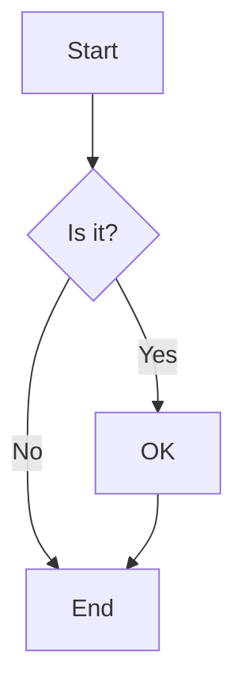
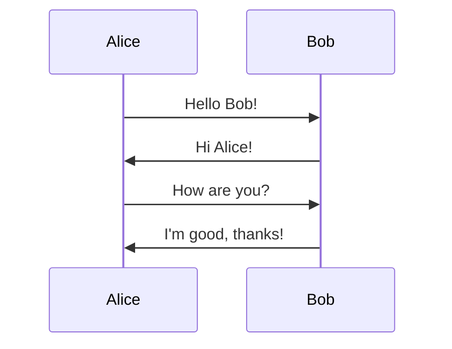
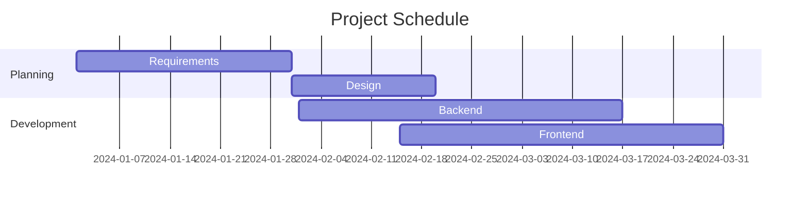
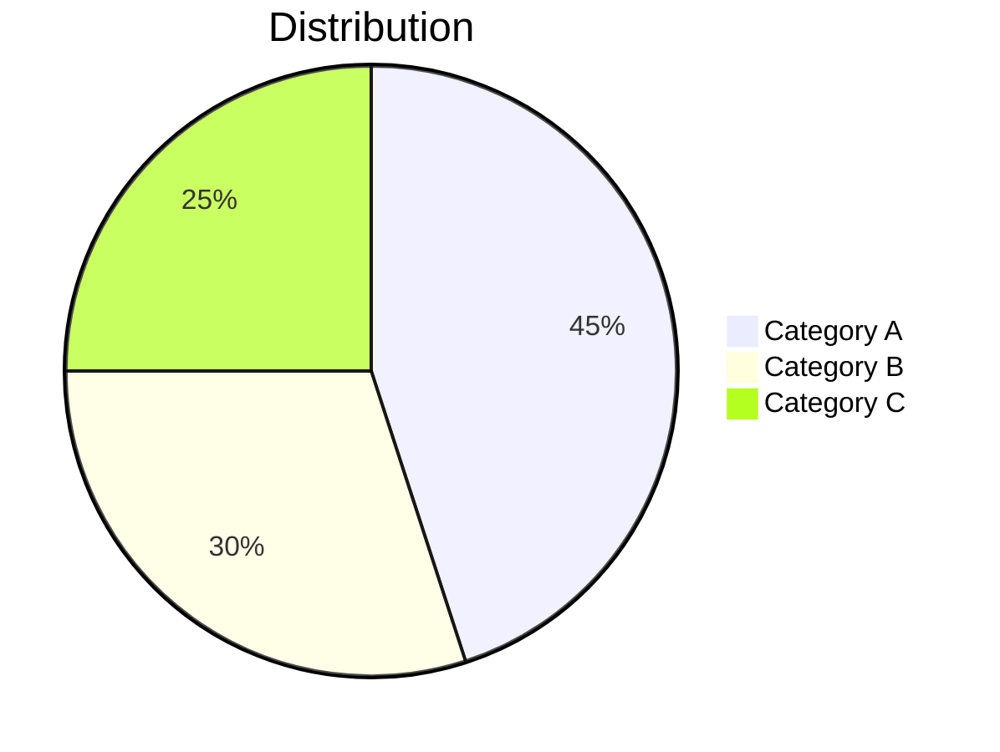
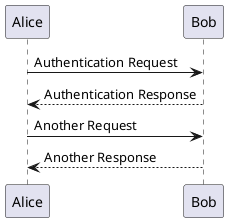
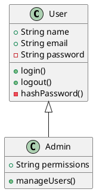
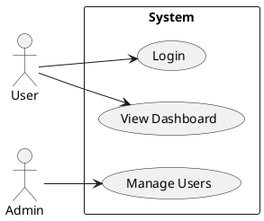

# Slidev Advanced Features

Comprehensive guide to advanced Slidev features including drawing, recording, icons, diagrams, and more.

## Drawing and Annotations

Slidev includes built-in drawing powered by drauu for annotating slides during presentations.

### Enabling Drawing

Drawing is enabled by default. Access via pen icon in navigation bar.

**Configuration:**

```md
---
drawings:
  enabled: true
  persist: false
  presenterOnly: false
  syncAll: true
---
```

**Options:**

- `enabled`: `true`, `false`, or `'dev'` (development only)
- `persist`: Save drawings as SVG files in `.slidev/drawings`
- `presenterOnly`: Only allow drawing in presenter mode
- `syncAll`: Sync drawings across all instances (when false, only presenter drawings sync)

### Using Drawing

1. Click pen icon in navigation bar
2. Choose drawing tool (pen, line, rectangle, circle, etc.)
3. Select color and width
4. Draw on slide
5. Drawings sync in real-time across instances

### Stylus Support

Slidev automatically detects stylus input on tablets:
- Use stylus for drawing
- Use fingers/mouse for navigation

### Persistent Drawings

Enable persistence to save drawings:

```md
---
drawings:
  persist: true
---
```

Drawings saved to `.slidev/drawings/` as SVG files and included in exports.

---

## Recording

Built-in recording feature for capturing presentations with audio.

### Camera View

1. Click camera button in navigation bar
2. Position and resize camera feed
3. Settings persist across reloads

### Recording Options

Click video button in navigation bar for recording dialog:

**Option 1: Embedded Recording**
- Camera feed embedded directly in slides
- Single video output

**Option 2: Separate Recording**
- Camera and slides as separate video files
- More flexible for editing

### Technologies

Built on:
- RecordRTC library
- WebRTC API

### Best Practices

- Test camera and microphone before recording
- Use good lighting for camera view
- Check audio levels
- Practice presentation flow
- Have backup recording method

---

## Icons

Access to thousands of open-source icons via Iconify.

### Icon Collections

Icons use format `{collection-name}-{icon-name}`:

**Popular Collections:**

- Material Design Icons: `mdi-*`
- Carbon: `carbon-*`
- Heroicons: `heroicons-*`
- Feather: `feather-*`
- Font Awesome: `fa-*`
- Logos: `logos-*`
- Emojis: `twemoji-*`, `noto-*`

### Installation

Install icon collections:

```bash
pnpm add -D @iconify-json/mdi
pnpm add -D @iconify-json/carbon
pnpm add -D @iconify-json/heroicons
```

Or install all collections:

```bash
pnpm add -D @iconify/json
```

### Usage

Use icons directly in markdown:

```md
<mdi-account-circle /> User Profile
<carbon-logo-github /> GitHub
<heroicons-rocket-launch /> Launch
```

### Styling Icons

Apply CSS classes:

```md
<mdi-heart class="text-red-500" />
<mdi-heart class="text-3xl" />
<mdi-heart class="text-red-500 text-3xl animate-pulse" />
```

### Icon Resources

- Browse icons: https://icones.js.org
- Iconify: https://iconify.design
- Icon collections: https://icon-sets.iconify.design

---

## Diagrams

### Mermaid Diagrams

Create diagrams with Mermaid syntax.

**Flow Charts:**

````md

````

**Sequence Diagrams:**

````md

````

**Gantt Charts:**

````md

````

**Pie Charts:**

````md

````

**Configuration:**

```md
---
mermaid:
  theme: default
  themeVariables:
    primaryColor: '#3b82f6'
---
```

### PlantUML Diagrams

Create UML diagrams with PlantUML.

**Sequence Diagrams:**

````md

````

**Class Diagrams:**

````md

````

**Use Case Diagrams:**

````md

````

---

## LaTeX Math

KaTeX integration for mathematical equations.

### Inline Math

```md
The equation $E = mc^2$ is famous.

Pythagorean theorem: $a^2 + b^2 = c^2$
```

### Block Math

```md
$$
\int_0^\infty e^{-x^2} dx = \frac{\sqrt{\pi}}{2}
$$

$$
\frac{\partial u}{\partial t} = \alpha \nabla^2 u
$$
```

### Matrix Notation

```md
$$
\begin{bmatrix}
a & b \\
c & d
\end{bmatrix}
\begin{bmatrix}
x \\
y
\end{bmatrix}
=
\begin{bmatrix}
ax + by \\
cx + dy
\end{bmatrix}
$$
```

### Chemical Formulas

```md
$$\ce{CO2 + C -> 2 CO}$$

$$\ce{H2SO4 + 2NaOH -> Na2SO4 + 2H2O}$$
```

### Configuration

```md
---
katex:
  macros:
    "\\RR": "\\mathbb{R}"
---
```

---

## Code Features

### Monaco Editor

Editable code blocks with VS Code editor.

**Basic Monaco:**

````md
```ts {monaco}
// This code is editable
function greet(name: string) {
  console.log(`Hello, ${name}!`)
}
```
````

**Monaco with Run:**

````md
```ts {monaco-run}
// Runs automatically
console.log('This executes on load')
```
````

**Configuration:**

```md
---
monaco:
  theme: vs-dark
  fontSize: 14
---
```

### Shiki Magic Move

Animated code transitions:

````md
```ts
// Before
const x = 10
```

```ts
// After - smoothly animates the change
const x = 20
const y = 30
```
````

### TwoSlash

Type information in code blocks:

````md
```ts twoslash
const greeting = "Hello"
//    ^?
```
````

### Line Highlighting

Progressive code highlighting:

````md
```ts {2|4-6|all}
function calculate() {
  const x = 10  // step 1
  const y = 20
  const sum = x + y  // step 2
  const product = x * y  // step 2
  const difference = x - y  // step 2
  return sum
}
```
````

### Max Height

Scrollable code blocks:

````md
```ts {maxHeight:'300px'}
// Long code here
// ...
// Will scroll after 300px
```
````

---

## Remote Access

Present from one device, control from another.

### Enable Remote Access

```bash
slidev --remote
```

Or in headmatter:

```md
---
remote: true
---
```

### Using Remote Control

1. Start server with `--remote`
2. Note the remote URL displayed
3. Open URL on control device
4. Navigate slides from any device
5. All instances stay synchronized

### Security

Remote access is password-protected by default. Set custom password:

```bash
slidev --remote --remote-password mypassword
```

---

## Presenter Mode

Dedicated presenter view with notes and controls.

### Opening Presenter Mode

- Click presenter icon in navigation bar
- Press `p` keyboard shortcut
- Visit `/presenter` route

### Features

**Split View:**
- Current slide
- Next slide preview
- Speaker notes
- Timer

**Controls:**
- Play/pause timer
- Reset timer
- Navigate slides
- Drawing tools

**Synchronized:**
- All windows sync navigation
- Drawings sync in real-time
- Click animations sync

### Auto Ruby Notes

Automatically generate ruby annotations for Japanese text in notes.

---

## Timer

Built-in presentation timer.

**Enable in Presenter Mode:**

Timer appears automatically in presenter view.

**Features:**
- Count up timer
- Configurable display
- Play/pause control
- Reset function

---

## SEO and Meta Tags

### Open Graph Images

Auto-generated OG images:

```md
---
title: My Presentation
ogImage: true
---
```

Custom OG image:

```md
---
ogImage: /og-image.jpg
---
```

### Meta Tags

```md
---
title: My Presentation
titleTemplate: '%s - Slidev'
description: Amazing presentation about web development
keywords: slidev,presentation,web
author: Your Name
---
```

---

## Global Layers

Persistent UI elements across all slides.

### Global Top Layer

Create `global-top.vue`:

```vue
<template>
  <div class="global-header">
    <div class="flex justify-between p-4">
      <div>My Presentation</div>
      <div>
        <SlideCurrentNo /> / <SlidesTotal />
      </div>
    </div>
  </div>
</template>

<style scoped>
.global-header {
  position: fixed;
  top: 0;
  left: 0;
  right: 0;
  background: rgba(0, 0, 0, 0.5);
  color: white;
  z-index: 100;
}
</style>
```

### Global Bottom Layer

Create `global-bottom.vue`:

```vue
<template>
  <div class="global-footer">
    <div class="text-center p-2">
      © 2024 Your Name
    </div>
  </div>
</template>

<style scoped>
.global-footer {
  position: fixed;
  bottom: 0;
  left: 0;
  right: 0;
  background: rgba(0, 0, 0, 0.3);
  color: white;
}
</style>
```

---

## Click Markers

Visual indicators for click animations.

**Enable:**

```md
---
clickMarkers: true
---
```

Shows visual markers for each click step.

---

## Draggable Elements

Make elements draggable in presenter mode.

```md
<VDrag>
  <div class="bg-blue-500 p-4">
    Drag me around
  </div>
</VDrag>
```

Position is saved and synced across instances.

---

## Zoom Slide

Zoom into specific slide areas.

**Usage:**

```md
<div v-zoom="2">
  This area zooms 2x on click
</div>
```

---

## Side Editor

Edit slides while presenting.

Enable in development mode:
- Shows editor sidebar
- Edit slides in real-time
- Changes reflect immediately

---

## Bundle Remote Assets

Download remote assets for offline use.

```bash
slidev build --bundle-remote-assets
```

Downloads all remote images and assets to build output.

---

## VS Code Extension

Official VS Code extension for Slidev.

**Features:**
- Syntax highlighting
- Preview in editor
- Snippets
- Navigation
- Formatting

**Installation:**

Search "Slidev" in VS Code extensions marketplace.

---

## Prettier Plugin

Format Slidev files with Prettier.

**Installation:**

```bash
pnpm add -D prettier-plugin-slidev
```

**Configuration:**

```json
{
  "plugins": ["prettier-plugin-slidev"]
}
```

**Format:**

```bash
slidev format
```

---

## Build and Deployment

### Static Build

Build for deployment:

```bash
slidev build
```

Output in `dist/` directory.

### Build Options

```bash
slidev build --base /presentations/
slidev build --out custom-dist/
```

### Deployment Platforms

**Netlify:**

```toml
[build]
  command = "npm run build"
  publish = "dist"
```

**Vercel:**

```json
{
  "buildCommand": "slidev build",
  "outputDirectory": "dist"
}
```

**GitHub Pages:**

```bash
slidev build --base /repo-name/
```

### SPA Mode

Build as single-page application:

```md
---
download: true
---
```

Adds download button for PDF in built app.

---

## Custom Setup

### Setup Files

Create `./setup/main.ts`:

```ts
import { defineAppSetup } from '@slidev/types'

export default defineAppSetup(({ app, router }) => {
  // Vue app setup
  app.use(myPlugin)

  // Router setup
  router.beforeEach((to, from) => {
    // Navigation guard
  })
})
```

### Preload

Create `./setup/preload.ts`:

```ts
import { definePreloadSetup } from '@slidev/types'

export default definePreloadSetup(() => {
  // Runs before app initialization
  console.log('Preload setup')
})
```

### Shortcuts

Create `./setup/shortcuts.ts`:

```ts
import { defineShortcutsSetup } from '@slidev/types'

export default defineShortcutsSetup((nav, base) => {
  return [
    ...base,
    {
      key: 'r',
      fn: () => nav.go(1),
      autoRepeat: true,
    },
  ]
})
```

---

## Performance Optimization

### Lazy Loading

Components are lazy-loaded automatically.

### Image Optimization

```md
{width=800}
```

Specify dimensions for better loading.

### Code Splitting

Built-in code splitting for large presentations.

### Preloading

Preload next slide for smooth transitions:

```md
---
preload: true
---
```

---

## Best Practices

1. **Assets**: Optimize images before importing
2. **Components**: Lazy load heavy components
3. **Code**: Use Monaco sparingly for performance
4. **Diagrams**: Pre-render complex diagrams
5. **Remote**: Test remote access before presenting
6. **Export**: Generate PDF backup early
7. **Drawing**: Test drawing tools on target device
8. **Recording**: Check audio/video before recording
9. **Themes**: Choose appropriate theme for content
10. **Testing**: Test on actual presentation hardware
