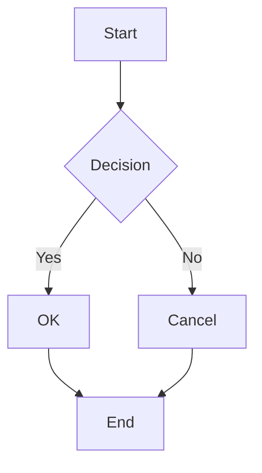
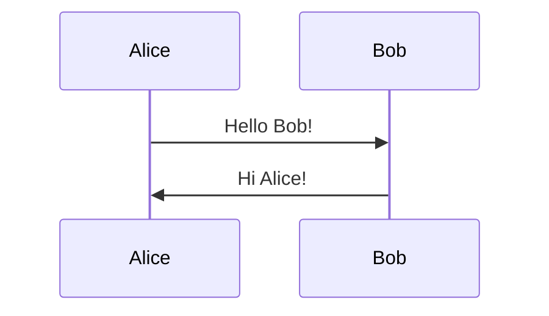
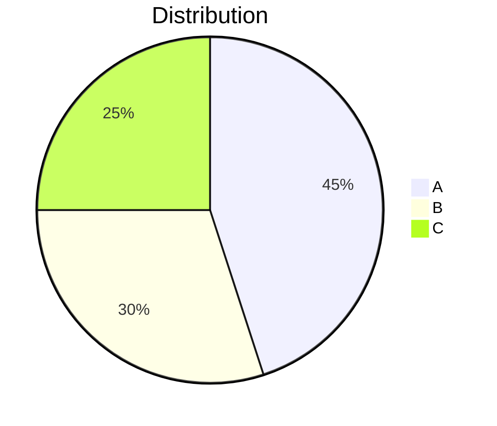
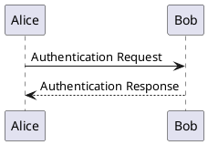
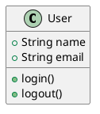

# Slidev Markdown Syntax Guide

Complete reference for Slidev's Markdown syntax and slide formatting.

## Slide Separators

Slides are separated using `---` with blank lines:

```md
# First Slide

Content here

---

# Second Slide

More content

---

# Third Slide

Final content
```

## Frontmatter Configuration

### Headmatter (Global Configuration)

First YAML block configures the entire presentation:

```md
---
theme: default
background: https://cover.sli.dev
title: My Presentation
titleTemplate: '%s - Slidev'
info: |
  ## My Presentation
  Description here
class: text-center
highlighter: shiki
lineNumbers: false
drawings:
  enabled: true
  persist: false
transition: slide-left
mdc: true
---
```

### Slide Frontmatter

Configure individual slides:

```md
---
layout: center
background: ./images/background.jpg
class: text-white
transition: fade
clicks: 3
---

# Slide Content
```

## Code Blocks

### Basic Syntax Highlighting

````md
```js
console.log('Hello World')
```

```ts
const greeting: string = 'Hello TypeScript'
```

```python
def hello():
    print("Hello Python")
```
````

### Line Numbers

````md
```ts {lines:true}
function greet(name: string) {
  console.log(`Hello, ${name}!`)
}
```
````

Or enable globally in headmatter:

```md
---
lineNumbers: true
---
```

### Line Highlighting

Highlight specific lines:

````md
```ts {2,4-6}
function calculate() {
  const x = 10  // highlighted
  const y = 20
  const sum = x + y  // highlighted
  const product = x * y  // highlighted
  const difference = x - y  // highlighted
  return sum
}
```
````

Multiple steps with click animations:

````md
```ts {2|4-6|all}
function calculate() {
  const x = 10  // step 1
  const y = 20
  const sum = x + y  // step 2
  const product = x * y  // step 2
  const difference = x - y  // step 2
  return sum
}
```
````

### Line Numbers with Highlighting

````md
```ts {lines:true, 2,4-6}
function calculate() {
  const x = 10  // line 2 highlighted
  const y = 20
  const sum = x + y  // lines 4-6 highlighted
  const product = x * y
  const difference = x - y
  return sum
}
```
````

### Monaco Editor

Editable code blocks:

````md
```ts {monaco}
// This code is editable!
console.log('Try editing me!')
```
````

With auto-run:

````md
```ts {monaco-run}
console.log('This runs automatically')
```
````

### Max Height

Limit code block height with scrolling:

````md
```ts {maxHeight:'200px'}
// Long code here
// ...
// Will scroll after 200px
```
````

### Code Groups

Tabbed code blocks:

````md
:::code-group

```js [index.js]
console.log('JavaScript')
```

```ts [index.ts]
console.log('TypeScript')
```

```python [main.py]
print('Python')
```

:::
````

### Import Code Snippets

Import from external files:

````md
```ts
<<< @/snippets/example.ts
```
````

With line range:

````md
```ts
<<< @/snippets/example.ts#5-10
```
````

With highlighting:

````md
```ts {2,4-6}
<<< @/snippets/example.ts
```
````

## Presenter Notes

Add notes visible only in presenter mode:

```md
# Slide Title

Content visible to audience

<!--
These are presenter notes
Only visible in presenter mode

Can include:
- Markdown **formatting**
- Lists
- Links [example](https://example.com)
- HTML <strong>tags</strong>
-->
```

Multiple note blocks are concatenated:

```md
# Slide

Content

<!-- Note 1 -->

More content

<!-- Note 2 -->
```

## MDC Syntax

Markdown Components (MDC) syntax for enhanced styling:

### Classes

```md
This text is [red]{.text-red-500}

:div{.bg-blue-500 .p-4}
Content in styled div
::
```

### Attributes

```md
{width=300 height=200}

:button{@click="count++"}
Click me
::
```

### Slots

```md
::card
#title
Card Title

#default
Card content goes here
::
```

## Diagrams

### Mermaid

````md





````

### PlantUML

````md



````

## LaTeX Math

### Inline Math

```md
The Pythagorean theorem is $a^2 + b^2 = c^2$.

Einstein's famous equation: $E = mc^2$
```

### Block Math

```md
$$
\int_0^\infty e^{-x^2} dx = \frac{\sqrt{\pi}}{2}
$$

$$
\frac{\partial u}{\partial t} = \nabla^2 u
$$
```

### Chemical Formulas

```md
$$\ce{CO2 + C -> 2 CO}$$

$$\ce{H2O}$$
```

## Links and Navigation

### External Links

```md
[Visit Slidev](https://sli.dev)

[GitHub](https://github.com/slidevjs/slidev)
```

### Slide Links

Navigate to specific slides:

```md
[Go to slide 5](5)

<Link to="5">Go to slide 5</Link>
```

## Images

### Basic Images

```md


```

### Background Images

In frontmatter:

```md
---
background: /background.jpg
---
```

With sizing:

```md
---
background: /background.jpg
backgroundSize: contain
---
```

### Sized Images

```md
{width=300}

{width=300 height=200}
```

## Lists

### Unordered Lists

```md
- First item
- Second item
  - Nested item
  - Another nested item
- Third item
```

### Ordered Lists

```md
1. First item
2. Second item
   1. Nested item
   2. Another nested item
3. Third item
```

### Click Animations with Lists

```md
<v-clicks>

- Appears first
- Appears second
- Appears third

</v-clicks>
```

## Tables

### Basic Tables

```md
| Header 1 | Header 2 | Header 3 |
|----------|----------|----------|
| Cell 1   | Cell 2   | Cell 3   |
| Cell 4   | Cell 5   | Cell 6   |
```

### Aligned Tables

```md
| Left | Center | Right |
|:-----|:------:|------:|
| L1   |   C1   |    R1 |
| L2   |   C2   |    R2 |
```

### Tables with Click Animations

```md
<v-clicks>

| Col 1 | Col 2 |
|-------|-------|
| A     | B     |
| C     | D     |

</v-clicks>
```

## Importing Slides

### Import from Files

```md
---
src: ./slides/intro.md
---

---
src: ./slides/content.md
---
```

### Import with Range

```md
---
src: ./slides/all.md
slide: 1-10
---
```

### Import with Frontmatter Override

```md
---
src: ./slides/content.md
background: /custom-bg.jpg
---
```

## HTML and Vue

### HTML Tags

```md
<div class="text-center text-3xl">
  Centered Large Text
</div>

<span class="text-red-500">Red Text</span>
```

### Vue Components

```md
<Counter :initial="10" />

<MyComponent title="Hello" :active="true" />
```

### Vue Directives

```md
<div v-if="show">Conditional content</div>

<div v-for="item in items" :key="item.id">
  {{ item.name }}
</div>

<button @click="count++">
  Clicked {{ count }} times
</button>
```

## Special Features

### Two-Column Layout Delimiters

```md
---
layout: two-cols
---

# Left Column

Content for left

::right::

# Right Column

Content for right
```

### Two-Column with Header

```md
---
layout: two-cols-header
---

# Spanning Header

::left::

Left content

::right::

Right content
```

### Slot Sugar

Custom slot content:

```md
::title::
Custom title content

::content::
Main content here
```

## Transitions

### Slide Transitions

```md
---
transition: slide-left
---
```

Available: `fade`, `slide-left`, `slide-right`, `slide-up`, `slide-down`, `view-transition`

### Element Transitions

```md
<div class="slidev-vclick-target">
  Custom transition
</div>

<style>
.slidev-vclick-target {
  transition: all 0.3s ease;
}
.slidev-vclick-hidden {
  opacity: 0;
  transform: translateY(20px);
}
</style>
```

## Styling

### Inline Styles

```md
<div style="color: red; font-size: 2rem;">
  Styled content
</div>
```

### CSS Classes

```md
<div class="bg-blue-500 text-white p-4 rounded-lg">
  Styled with UnoCSS
</div>
```

### Slide-Scoped Styles

```md
# Slide Content

<style>
h1 {
  color: #3b82f6;
  font-size: 3rem;
}

p {
  margin-top: 1rem;
}
</style>
```

### Global Styles

Create `./styles/index.css`:

```css
h1 {
  @apply text-4xl font-bold;
}

.custom-class {
  background: linear-gradient(to right, #3b82f6, #8b5cf6);
}
```

## Best Practices

1. **Consistency**: Use consistent formatting throughout
2. **Frontmatter**: Place all configuration in frontmatter
3. **Code Blocks**: Use syntax highlighting for all code
4. **Notes**: Add presenter notes for complex slides
5. **Assets**: Use relative paths for local assets
6. **Components**: Prefer built-in components over HTML
7. **Animations**: Use v-clicks for progressive disclosure
8. **Layouts**: Choose appropriate layouts for content type
