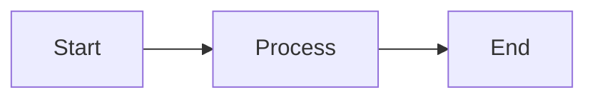

<div align="center">

# 🎬 Talk to Slidev Workflow

### **Your AI-Powered Keynote Presentation Team**

[← Back to AI Workflow](../../README.md)

[简体中文](./README_cn.md) | English

</div>

---

## 🎯 Who Is This For?

- **Keynote Speakers** - Automated slide deck creation with beautiful animations
- **Tech Conference Presenters** - Mermaid diagrams, code blocks, technical slides
- **Startup Founders** - Pitch decks with professional visual design
- **Educators & Trainers** - Course materials and lecture slides

---

## ⚡ Quick Install

```bash
# Install all 20 skills with one command
npx add-skill nicepkg/ai-workflow/workflows/talk-to-slidev-workflow

# Or install specific skills
npx add-skill nicepkg/ai-workflow/workflows/talk-to-slidev-workflow --skill ppt-creator
```

---

## 📦 Skills Included (20)

### 0️⃣ Idea to Narrative Structure
| Skill | What It Does |
|:------|:-------------|
| `storyline-builder` | McKinsey MECE narrative framework, slide titles, key transitions |
| `presentation-builder` | General presentation structure with visual cues |

### 1️⃣ Script & Speaker Notes
| Skill | What It Does |
|:------|:-------------|
| `ppt-creator` | Complete speech script, speaker notes, storytelling beats |
| `presentation-generator` | HTML deck generation, backup export formats |

### 2️⃣ Visual Theme & Design
| Skill | What It Does |
|:------|:-------------|
| `theme-factory` | One-click theme selection: colors, fonts, consistent style |
| `presentation-design-enhancer` | Transform bullet points into visual narratives |
| `color-palette-extractor` | Extract and apply color schemes from images |
| `font-pairing-suggester` | Professional font combinations for presentations |
| `canvas-design` | Visual asset creation for slides |

### 3️⃣ Media & Assets
| Skill | What It Does |
|:------|:-------------|
| `pexels-media` | Find royalty-free images and videos with metadata |
| `nano-banana-pro` | AI-generated illustrations, infographics, cover images |
| `youtube-transcript` | Extract content from YouTube for research/citations |
| `transcribe-and-analyze` | Audio/video transcription and analysis |

### 4️⃣ Diagrams & Infographics
| Skill | What It Does |
|:------|:-------------|
| `mermaid-diagrams` | Flowcharts, architecture diagrams, timelines for Slidev |
| `mermaid-tools` | Advanced Mermaid diagram editing and validation |
| `infographic-creation` | Transform text into infographic-style visuals |

### 5️⃣ Export & Repurpose
| Skill | What It Does |
|:------|:-------------|
| `pptx` | Export to PowerPoint format when needed |
| `social-repurposer` | Repurpose slides for social media (LinkedIn, Twitter) |

### 6️⃣ Slidev Framework Reference
| Skill | What It Does |
|:------|:-------------|
| `slidev` | Comprehensive Slidev framework guide: syntax, layouts, components, animations, theming, exporting |
| `slidev-presentations` | Plan-first presentation workflow with `/slidev:plan`, `/slidev:from-plan`, `/slidev:new` commands |

---

## 🔄 Complete Pipeline (6 Stages)

```
Stage 0: Idea Input
└── storyline-builder → MECE narrative structure with slide titles

Stage 1: Script Generation
├── ppt-creator → Complete speech with speaker notes
└── presentation-builder → Detailed presentation outline

Stage 2: Slidev Generation
├── slidev-presentations → Plan-first workflow (/slidev:plan → /slidev:from-plan)
├── slidev → Framework reference for syntax, layouts, animations
├── theme-factory → Apply consistent visual theme
└── presentation-design-enhancer → Visualize text-heavy slides

Stage 3: Media & Assets
├── pexels-media → Find stock images
├── nano-banana-pro → Generate custom visuals
└── color-palette-extractor → Extract theme colors

Stage 4: Diagrams & Charts
├── mermaid-diagrams → Technical diagrams
├── mermaid-tools → Validate and enhance diagrams
└── infographic-creation → Summary/framework pages

Stage 5: Export & Share
├── pptx → PowerPoint backup export
└── social-repurposer → Social media snippets
```

---

## 💡 Example Workflows

### Tech Conference Talk
```
1. "I want to present 'How We Scaled to 1M Users' - create the narrative structure"
2. "Generate the full speech script with speaker notes"
3. "Create Slidev markdown with technical architecture diagrams"
4. "Add mermaid diagrams for the system architecture"
5. "Find relevant stock images for each section"
6. "Apply a modern dark theme suitable for tech conferences"
```

### Startup Pitch Deck
```
1. "Create a 10-slide pitch deck structure for a SaaS startup"
2. "Generate compelling narrative with problem-solution-market flow"
3. "Design infographics for market size and growth projections"
4. "Add professional visuals and consistent branding"
5. "Export to PPTX for investor meetings"
```

### Educational Course
```
1. "Build a lecture series structure for 'Introduction to Machine Learning'"
2. "Create slides with step-by-step explanations"
3. "Add mermaid diagrams for algorithm flowcharts"
4. "Include code blocks with syntax highlighting"
5. "Generate summary infographics for each module"
```

### YouTube Script to Slides
```
1. "Extract transcript from this YouTube video"
2. "Convert the content into a presentation outline"
3. "Generate Slidev slides with key points"
4. "Add relevant visuals and diagrams"
```

---

## 🔗 Skill Combinations

| Goal | Skill Chain |
|:-----|:------------|
| **Full Keynote** | storyline-builder → ppt-creator → theme-factory → presentation-design-enhancer → mermaid-diagrams → pexels-media |
| **Tech Talk** | storyline-builder → ppt-creator → mermaid-diagrams → mermaid-tools → canvas-design |
| **Pitch Deck** | presentation-builder → ppt-creator → infographic-creation → nano-banana-pro → pptx |
| **Video to Slides** | youtube-transcript → storyline-builder → ppt-creator → presentation-design-enhancer |
| **Visual Design** | theme-factory → color-palette-extractor → font-pairing-suggester → canvas-design |
| **Social Snippets** | presentation-generator → social-repurposer |

---

## 🛠 Slidev Quick Reference

### Basic Slide Structure
```markdown
---
theme: seriph
background: https://example.com/image.jpg
class: text-center
---

# Slide Title

Content goes here

---

# Next Slide
```

### Mermaid Diagram
````markdown

````

### Code Block with Highlighting
````markdown
```python {1-3|5-7}
def hello():
    print("Hello")
    return True

def world():
    print("World")
    return True
```
````

---

## 📄 License

MIT © [nicepkg](https://github.com/nicepkg)

<div align="center">

**[⬆ Back to Main Project](../../README.md)**

</div>
