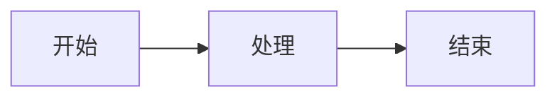

<div align="center">

# 🎬 Talk to Slidev 工作流

### **你的 AI 主题演讲团队**

[← 返回 AI Workflow](../../README_cn.md)

简体中文 | [English](./README.md)

</div>

---

## 🎯 适合谁？

- **主题演讲者** - 自动化创建精美动效的演示文稿
- **技术大会讲者** - Mermaid 图表、代码块、技术幻灯片
- **创业者** - 专业视觉设计的路演 Pitch Deck
- **讲师 & 培训师** - 课程材料和讲座幻灯片

---

## ⚡ 快速安装

```bash
# 一键安装全部 20 个技能
npx add-skill nicepkg/ai-workflow/workflows/talk-to-slidev-workflow

# 或安装单个技能
npx add-skill nicepkg/ai-workflow/workflows/talk-to-slidev-workflow --skill ppt-creator
```

---

## 📦 包含技能 (20个)

### 0️⃣ 主意到叙事结构
| 技能 | 功能描述 |
|:-----|:---------|
| `storyline-builder` | 麦肯锡 MECE 叙事框架、幻灯片标题、关键转折 |
| `presentation-builder` | 通用演示结构和视觉提示 |

### 1️⃣ 演讲稿 & Speaker Notes
| 技能 | 功能描述 |
|:-----|:---------|
| `ppt-creator` | 完整演讲稿、讲者备注、故事节拍 |
| `presentation-generator` | HTML deck 生成、备用导出格式 |

### 2️⃣ 视觉主题 & 设计
| 技能 | 功能描述 |
|:-----|:---------|
| `theme-factory` | 一键选主题：配色、字体、统一风格 |
| `presentation-design-enhancer` | 把密密麻麻的要点变成视觉叙事 |
| `color-palette-extractor` | 从图片提取并应用配色方案 |
| `font-pairing-suggester` | 专业字体搭配建议 |
| `canvas-design` | 幻灯片视觉素材创建 |

### 3️⃣ 媒体 & 素材
| 技能 | 功能描述 |
|:-----|:---------|
| `pexels-media` | 查找免版税图片和视频，带元数据 |
| `nano-banana-pro` | AI 生成插画、信息图、封面图 |
| `youtube-transcript` | 从 YouTube 提取内容用于研究/引用 |
| `transcribe-and-analyze` | 音视频转录和分析 |

### 4️⃣ 图表 & 信息图
| 技能 | 功能描述 |
|:-----|:---------|
| `mermaid-diagrams` | 流程图、架构图、时间线（Slidev 原生支持） |
| `mermaid-tools` | 高级 Mermaid 图表编辑和验证 |
| `infographic-creation` | 把文字总结成信息图式表达 |

### 5️⃣ 导出 & 转换
| 技能 | 功能描述 |
|:-----|:---------|
| `pptx` | 需要时导出为 PowerPoint 格式 |
| `social-repurposer` | 把幻灯片转换为社媒内容（LinkedIn、Twitter） |

### 6️⃣ Slidev 框架参考
| 技能 | 功能描述 |
|:-----|:---------|
| `slidev` | Slidev 框架完整指南：语法、布局、组件、动画、主题、导出 |
| `slidev-presentations` | 计划优先的演示工作流，支持 `/slidev:plan`、`/slidev:from-plan`、`/slidev:new` 命令 |

---

## 🔄 完整流水线（6阶段）

```
阶段 0: 主意输入
└── storyline-builder → MECE 叙事结构和幻灯片标题

阶段 1: 讲稿生成
├── ppt-creator → 完整演讲稿和讲者备注
└── presentation-builder → 详细演示大纲

阶段 2: Slidev 生成
├── slidev-presentations → 计划优先工作流 (/slidev:plan → /slidev:from-plan)
├── slidev → 框架参考：语法、布局、动画
├── theme-factory → 应用统一视觉主题
└── presentation-design-enhancer → 把文字页视觉化

阶段 3: 媒体 & 素材
├── pexels-media → 查找素材图
├── nano-banana-pro → 生成自定义视觉
└── color-palette-extractor → 提取主题配色

阶段 4: 图表 & 图形
├── mermaid-diagrams → 技术图表
├── mermaid-tools → 验证和增强图表
└── infographic-creation → 总结/框架页

阶段 5: 导出 & 分享
├── pptx → PowerPoint 备用导出
└── social-repurposer → 社媒片段
```

---

## 💡 使用示例

### 技术大会演讲
```
1. "我想做一个'我们如何扩展到100万用户'的演讲，创建叙事结构"
2. "生成完整的演讲稿和讲者备注"
3. "用技术架构图创建 Slidev markdown"
4. "为系统架构添加 mermaid 图表"
5. "为每个章节找相关的素材图"
6. "应用适合技术大会的现代深色主题"
```

### 创业路演 Pitch Deck
```
1. "为一个 SaaS 创业公司创建 10 页的 Pitch Deck 结构"
2. "生成有说服力的叙事：问题-解决方案-市场"
3. "为市场规模和增长预测设计信息图"
4. "添加专业视觉和统一品牌"
5. "导出 PPTX 用于投资人会议"
```

### 教育课程
```
1. "为'机器学习入门'构建讲座系列结构"
2. "创建逐步讲解的幻灯片"
3. "为算法流程添加 mermaid 图表"
4. "包含带语法高亮的代码块"
5. "为每个模块生成总结信息图"
```

### YouTube 视频转幻灯片
```
1. "从这个 YouTube 视频提取字幕"
2. "把内容转换成演示大纲"
3. "生成带关键要点的 Slidev 幻灯片"
4. "添加相关的视觉和图表"
```

---

## 🔗 技能组合

| 目标 | 技能链 |
|:-----|:-------|
| **完整主题演讲** | storyline-builder → ppt-creator → theme-factory → presentation-design-enhancer → mermaid-diagrams → pexels-media |
| **技术演讲** | storyline-builder → ppt-creator → mermaid-diagrams → mermaid-tools → canvas-design |
| **Pitch Deck** | presentation-builder → ppt-creator → infographic-creation → nano-banana-pro → pptx |
| **视频转幻灯片** | youtube-transcript → storyline-builder → ppt-creator → presentation-design-enhancer |
| **视觉设计** | theme-factory → color-palette-extractor → font-pairing-suggester → canvas-design |
| **社媒片段** | presentation-generator → social-repurposer |

---

## 🛠 Slidev 快速参考

### 基本幻灯片结构
```markdown
---
theme: seriph
background: https://example.com/image.jpg
class: text-center
---

# 幻灯片标题

内容在这里

---

# 下一张幻灯片
```

### Mermaid 图表
````markdown

````

### 带高亮的代码块
````markdown
```python {1-3|5-7}
def hello():
    print("Hello")
    return True

def world():
    print("World")
    return True
```
````

---

## 📄 开源协议

MIT © [nicepkg](https://github.com/nicepkg)

<div align="center">

**[⬆ 返回主项目](../../README_cn.md)**

</div>
